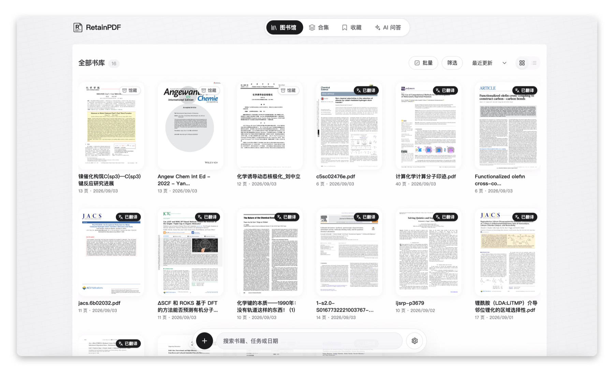
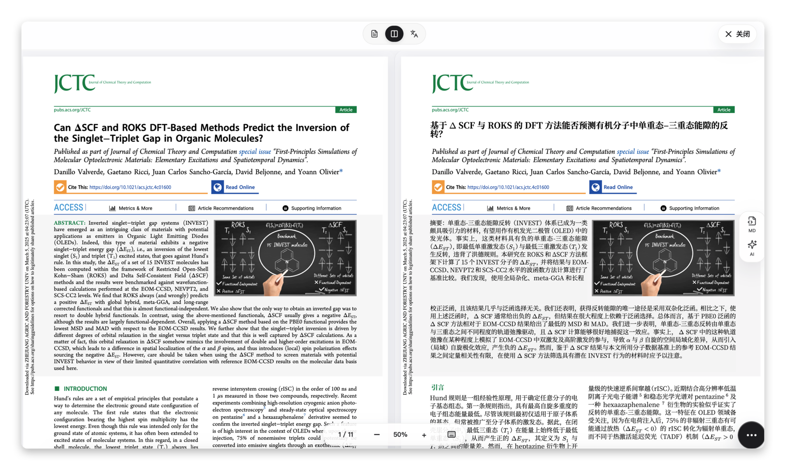
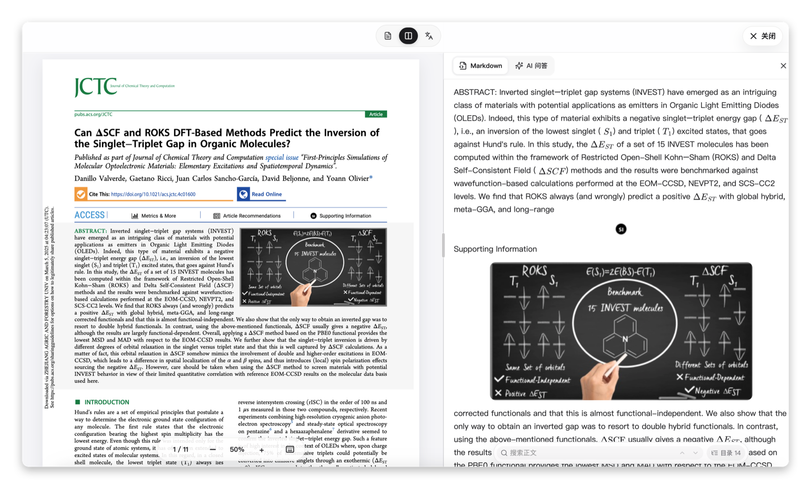
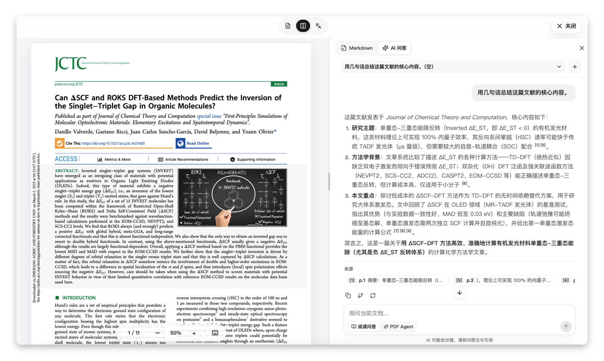
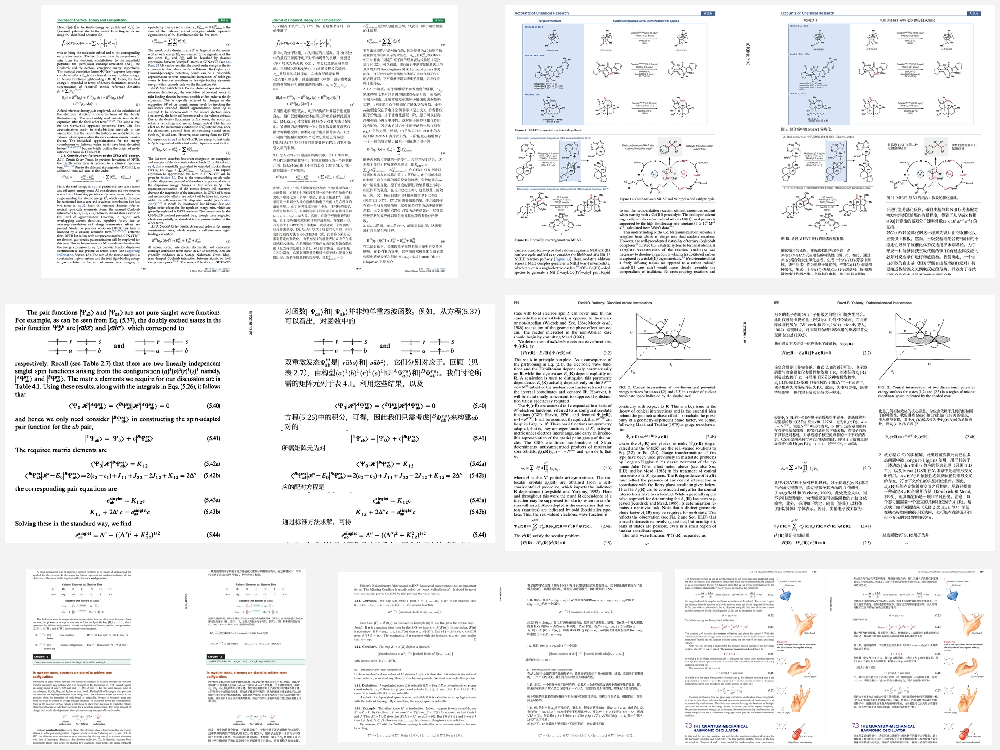

# RetainPDF: Layout-Preserving PDF Translation

<p align="center">
  <a href="README.md">中文</a> · <a href="README.en.md">English</a> · <a href="README.vi.md">Tiếng Việt</a>
</p>

<p align="center">
  
</p>

RetainPDF is currently the only open-source project built for layout-preserving translation of image-based and scanned PDFs, with translation and typesetting quality that matches or even surpasses comparable commercial products.

Its in-house typography algorithm restores complex formulas and multi-column paper layouts. Scanned PDF translation, PDF structure optimization, code protection, custom translation strategies, and an open API are all included.

The translation system is also built in-house, with dedicated handling for cross-column and cross-page passages, broken sentences, and continued paragraphs. It restores complete semantic units before translation instead of translating isolated OCR boxes and losing context.

**Inline formulas are RetainPDF's defining advantage: formulas, surrounding text, and inline layout remain stable after translation—something other open-source PDF translators do not currently achieve.**

The code, API, and deployment stack are fully open, with support for self-hosting and further development.

Core capability comparison:

| Project | Scanned PDFs | Complex inline formulas | Protect code from translation | Table control | Custom translation strategy | Layout preservation | PDF size optimization | API automation |
| --- | --- | --- | --- | --- | --- | --- | --- | --- |
| PDFMathTranslate | ❌ | ❌ | ❌ | Limited | Limited | Average | Average | ✅ |
| PolyglotPDF | ❌ | ❌ | ❌ | Limited | Limited | Average | Average | ✅ |
| Doc2X | ✅ | ✅ | ❌ | Moderate | Limited | Strong | Limited | ❌ Not public |
| RetainPDF | ✅ | ✅ Strong preservation | ✅ | ✅ Optional | ✅ Rule-based | Strong | ✅ Continuously improved | ✅ |

## Product

### Library

Manage papers, books, and scanned documents in one library, with translation status, collections, and favorites.

<p align="center">
  
</p>

### Side-by-side reading

Compare the source and translated PDFs on the same page to verify formulas, figures, citations, and layout.

<p align="center">
  
</p>

### Markdown reading

Read PDF and Markdown side by side while preserving formulas and images.

<p align="center">
  
</p>

### Document AI

Ask questions about the current document and receive answers with page-level citations. Switch explicitly to PDF Agent when you need to modify the PDF.

<p align="center">
  
</p>

## Translation examples

Source-to-translation examples for scientific papers, scanned PDFs, formula-heavy documents, and books:

<p align="center">
  
</p>

<p align="center"><sub>Row 1: scientific papers · Row 2: scanned and formula-heavy documents · Row 3: books and textbooks</sub></p>

## Quick start

Download the appropriate package from [GitHub Releases](https://github.com/wxyhgk/retain-pdf/releases):

- Windows: `Setup.exe`
- macOS: `.dmg`
- Linux: `.deb`

### Desktop

<p align="center">
  
</p>

If macOS reports that the app is damaged, move it to `/Applications` and run:

```bash
sudo xattr -r -d com.apple.quarantine /Applications/RetainPDF.app
```

### Docker

```bash
git clone https://github.com/wxyhgk/retain-pdf.git
cd retain-pdf/ops/deployment/docker/delivery
docker compose up -d
```

Open <http://127.0.0.1:40001>. To update:

```bash
docker compose pull
docker compose up -d
```

See the [Docker deployment guide](ops/deployment/docker/delivery/README.md) for more options.

## Community

QQ group: `1101779791`

<p align="center">
  
</p>

## Development

See the [contribution guide](CONTRIBUTING.md), [project documentation](docs/README.md), and [backend guide](backend/README.md).

## License

This project is distributed under the MIT License. See [LICENSE](LICENSE) for the full text.
