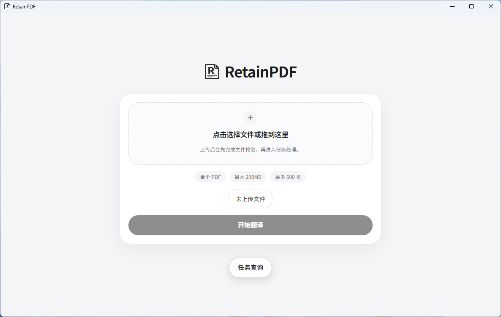
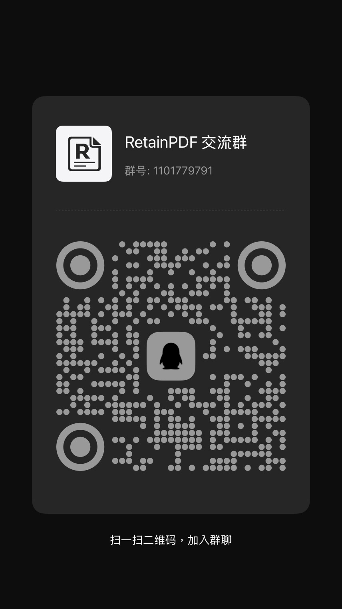

# RetainPDF: Công cụ Dịch PDF Giữ Nguyên Bố cục

<p align="center">
  
</p>


Các dự án mã nguồn mở về giữ nguyên bố cục khi dịch PDF không ít, nhưng hầu hết đều tập trung vào các tệp PDF có thể sao chép, chỉnh sửa được và các tình huống công thức nội tuyến không quá phức tạp.

RetainPDF ngay từ đầu đã được thiết kế để giải quyết vấn đề dịch PDF giữ nguyên bố cục cho mọi loại PDF, đặc biệt là PDF dạng hình ảnh/quét và vấn đề hiển thị công thức nội tuyến.

Trong lĩnh vực dịch PDF giữ nguyên bố cục, RetainPDF cạnh tranh trực tiếp với các mô hình nguồn đóng và thậm chí còn làm tốt hơn ở một số tình huống, chẳng hạn như kích thước PDF sau dịch, tốc độ tổng thể và kiểm soát kích thước font chữ.

Ngoài ra, dự án này là một dự án full-stack với frontend và backend tách biệt, tích hợp OCR, dịch, dàn trang và giao hàng liền mạch. Cấu trúc tổng thể được thiết kế để tách rời, giúp dễ dàng sử dụng trực tiếp cũng như mở rộng, thay thế module và phát triển thứ cấp sau này.


So sánh đơn giản:

| Dự án | PDF quét | Công thức nội tuyến phức tạp | Mã code không dịch sai | Kiểm soát bảng | Chiến lược dịch tùy chỉnh | Giữ bố cục | Tối ưu nén PDF | Tự động hóa API |
| --- | --- | --- | --- | --- | --- | --- | --- | --- |
| PDFMathTranslate | ❌ | ❌ | ❌ | Yếu | Yếu | Trung bình | Trung bình | ✅ |
| PolyglotPDF | ❌ | ❌ | ❌ | Yếu | Yếu | Trung bình | Trung bình | ✅ |
| Doc2X | ✅ | ✅ | ❌ | Trung bình | Yếu | Mạnh | Yếu | ❌ Không mở |
| RetainPDF | ✅ | ✅ | ✅ | ✅ Có thể bật/tắt | ✅ Có thể cấu hình theo quy tắc | Mạnh | ✅ Tối ưu liên tục | ✅ |

## Hình ảnh Minh họa

### Bài báo Khoa học (SCI)

<p align="center">
  
</p>

<p align="center">
  
</p>

### PDF dạng Hình ảnh / Quét

<p align="center">
  
</p>

<p align="center">
  
</p>

### Sách

<p align="center">
  
</p>

<p align="center">
  
</p>

<p align="center">
  
</p>

## Bắt đầu Nhanh

Nếu bạn chỉ muốn sử dụng trực tiếp, hãy tải xuống gói phát hành cho nền tảng tương ứng từ [GitHub Releases](https://github.com/wxyhgk/retain-pdf/releases):

- Windows: Tải `Setup.exe`
- macOS: Tải `.dmg`
- Linux: Tải `.deb`

Nếu bạn muốn sử dụng cho mạng nội bộ, nhóm hoặc nhiều thiết bị cùng lúc, hãy ưu tiên triển khai Docker.

### Windows Desktop

<p align="center">
  
</p>

### Lưu ý cho macOS

Do hiện tại không có tài khoản nhà phát triển Apple, phiên bản macOS có thể hiển thị thông báo ứng dụng "đã hỏng" khi mở lần đầu. Đây không phải là tệp thực sự bị hỏng, mà là do hệ thống kiểm tra chữ ký. Sau khi kéo ứng dụng vào `/Applications`, hãy thực thi:

```bash
sudo xattr -r -d com.apple.quarantine /Applications/RetainPDF.app
```

Sau đó mở lại ứng dụng.

### Triển khai Docker

Hiện tại kho lưu trữ cung cấp thư mục giao hàng Docker:

- [docker/delivery/README.md](docker/delivery/README.md)
- [docker/delivery/docker-compose.yml](docker/delivery/docker-compose.yml)

Các bước cơ bản:

```bash
git clone https://github.com/wxyhgk/retain-pdf.git
cd retain-pdf/docker/delivery
docker compose up -d
```

Sau khi khởi động, truy cập mặc định tại:

```text
http://127.0.0.1:40001
```

Cổng mặc định:

- `40001`: Trang frontend
- `41000`: Rust API
- `42000`: Giao diện submit bất đồng bộ multipart

### Cập nhật Docker

Nếu chỉ cập nhật lên phiên bản image mới nhất:

```bash
cd retain-pdf/docker/delivery
docker compose pull
docker compose up -d
```

Nếu bạn muốn chuyển sang một phiên bản image cụ thể, cũng có thể thực hiện như sau:

```bash
cd retain-pdf/docker/delivery
APP_IMAGE=wxyhgk/retainpdf-app:<version> \
WEB_IMAGE=wxyhgk/retainpdf-web:<version> \
docker compose up -d
```

Sau khi cập nhật, nên thực hiện kiểm tra trạng thái một lần:

```bash
docker compose ps
```

Địa chỉ image hiện tại:

- [wxyhgk/retainpdf-app](https://hub.docker.com/r/wxyhgk/retainpdf-app)
- [wxyhgk/retainpdf-web](https://hub.docker.com/r/wxyhgk/retainpdf-web)

## Nhóm Trao đổi

Nếu bạn gặp vấn đề khi sử dụng, triển khai hoặc phát triển thứ cấp RetainPDF, hãy tham gia nhóm trao đổi QQ để thảo luận cùng nhau.

- Số nhóm QQ: `1101779791`

<p align="center">
  
</p>

## Nhà phát triển


### Cổng thông tin Tài liệu

Đề xuất đọc theo thứ tự sau.

- [Hướng dẫn Đóng góp](CONTRIBUTING.md)
- [Mục lục Tài liệu](doc/README.md)
- [Tài liệu Chính](doc/core/README.md)
- [Tài liệu Tham khảo](doc/reference/README.md)
- [Vận hành và Ghi chép Quá trình](doc/ops/README.md)
- [Hợp đồng Giai đoạn Pipeline](backend/scripts/runtime/pipeline/README.md)

### Mô tả Mã nguồn và Mô-đun Con

- [Giải thích script backend](backend/scripts/README.md)
- `frontend/`: Frontend hiện đang sử dụng trong sản xuất, cũng là thư mục đầu vào cho bundle desktop; ba trang index/reader/detail đều đã được chuyển sang React SPA (`src/pages/` là cổng vào thế giới mới, esbuild đóng gói, `src/js/` giữ lại lõi logic thuần).
- `frontend-react/`: Khu vực chuyển đổi frontend React khác (công nghệ độc lập: Vite + TypeScript), hiện không thay thế trực tiếp `frontend/`.
- `desktop/`: Vỏ đóng gói và chạy Electron cho desktop.

### Cấu trúc Thư mục Hiện tại

- `frontend/`
  Frontend hiện đang sử dụng trong sản xuất, ba trang React SPA (esbuild đóng gói), mã nguồn nằm trong `frontend/src/pages/`.
- `frontend-react/`
  Khu vực chuyển đổi frontend React khác (công nghệ độc lập).
- `desktop/`
  Đóng gói Electron desktop, vỏ chạy và bundle frontend cho desktop.
- `backend/`
  Rust API, script Python, Python nhúng, khu vực làm việc lịch sử.
- `docker/`
  Dockerfile, script phát hành, cấu hình compose cho giao hàng.
- `experiments/`
  Thí nghiệm độc lập, ghi chép xác minh và POC tạm thời.
- `data/`
  Đầu ra chạy cục bộ, thư mục tác vụ, dữ liệu mẫu lịch sử.
- `resources/`
  Hình ảnh thương hiệu cấp kho, hình ảnh hiển thị README, hoạt ảnh, tệp mẫu và cổng lưu trữ runtime cục bộ sau này.

### Trạng thái Phát triển Hiện tại

RetainPDF hiện đã hình thành một quy trình sản phẩm hoàn chỉnh:

- Rust API chịu trách nhiệm upload, tác vụ, thư viện, sự kiện, artifact, khôi phục điểm dừng và điều phối Provider.
- Python pipeline chịu trách nhiệm chuẩn hóa OCR, dịch, chẩn đoán, render và xử lý PDF.
- `frontend/` là cổng vào sản xuất hiện tại, đã là ba trang React SPA; `frontend-react/` là khu vực chuyển đổi với công nghệ độc lập.
- Docker và desktop là các hình thức giao hàng chính hiện nay.
- API, cơ sở dữ liệu, artifact, reader, glossary và stage spec đã có tài liệu chính duy trì.

Ưu tiên phát triển hiện tại dựa trên hợp đồng chính, chủ yếu tập trung vào:

- Trải nghiệm thư viện frontend, reader, tiến độ tác vụ và bảng thuật ngữ.
- Thu hẹp ranh giới Rust API, duy trì cơ sở dữ liệu và quản lý artifact.
- Tính nhất quán dịch Python, bảo vệ công thức, ổn định render và khả năng chẩn đoán.
- Giao hàng có thể tái hiện cho Docker, desktop, CI và mẫu thử nghiệm.
- Đồng bộ tài liệu với API / cấu hình / cấu trúc thư mục thực tế.

### Mời Tham gia Cùng Phát triển

Nếu bạn cũng quan tâm đến những hướng sau, mời cùng nhau tiếp tục phát triển dự án này:

- OCR độ chính xác cao / phân tích bố cục khó
- Tính ổn định dịch trong các tình huống văn bản dài và công thức
- Điền lại bố cục, tự động điều chỉnh font chữ và render PDF
- Hoàn thiện giao hàng desktop, Docker và kỹ nghệ

Dù bạn giỏi hơn về thuật toán, frontend, backend hay triển khai, chỉ cần bạn cũng muốn đào sâu vào việc "dịch PDF giữ nguyên bố cục thực sự hữu dụng", mời tham gia cùng phát triển.

## License

This project is distributed under the MIT License. See [LICENSE](LICENSE) for the full text.
