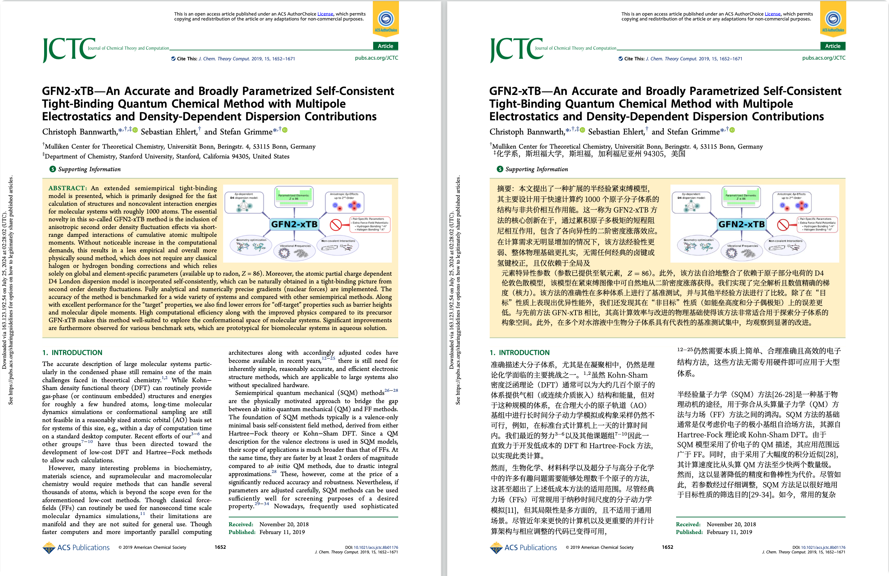

**Điểm đau**

Bài báo, giáo trình, tài liệu kỹ thuật tiếng nước ngoài có mật độ thông tin cao nhưng đọc rất mất công:

- Ngưỡng đọc bản gốc cao, hiệu quả thấp
- Công cụ dịch thông thường chỉ xuất văn bản thuần, công thức, hình ảnh, bố cục gần như hỏng hoàn toàn
- Kết quả sau dịch khó sắp xếp, khó chia sẻ, khó lưu trữ

**RetainPDF làm gì**

Tải lên PDF, một cú nhấp chuột nhận bản dịch tiếng Việt giữ nguyên bố cục gốc.

- Xuất bản dịch PDF, Markdown, ZIP đóng gói, lấy theo nhu cầu
- Thao tác trực tiếp trên giao diện web, cũng hỗ trợ CLI và API
- PDF dạng hình ảnh (bản scan, bản chụp màn hình) cũng xử lý được, không chỉ giới hạn ở PDF có thể chỉnh sửa

**Minh họa hiệu quả dịch**

Hiệu quả dịch bài báo SCI thông thường:



So sánh hiệu quả dịch PDF dạng ảnh:


**So với các giải pháp cùng loại, ưu điểm ở đâu**

- So với [PDFMathTranslate](https://github.com/PDFMathTranslate/PDFMathTranslate): Bổ sung điểm yếu của PDF dạng hình ảnh, công thức nội tuyến kết nối với văn bản chính tự nhiên hơn, xác suất hỏng bố cục thấp hơn rõ rệt
- So với các giải pháp đóng như Doc2X: Có thể tự triển khai, tự kiểm soát API và tệp kết quả; hiệu quả tổng thể thực tế cũng tốt hơn
- Sản phẩm đầu ra gần như có thể dùng ngay, không cần chỉnh sửa bố cục thủ công


# Người dùng cơ bản

Nếu bạn chỉ muốn chạy dịch vụ, làm theo các bước dưới đây là đủ.

## 1. Xác nhận môi trường máy trước

Môi trường khuyến nghị:

- Hệ thống: Ưu tiên `Linux`, khuyến nghị `Ubuntu 22.04 / 24.04`
- Kiến trúc CPU: Hiện tại image được xây dựng cho `x86_64 / amd64`, không phải phiên bản ARM
- CPU: Ít nhất `4 nhân`
- Bộ nhớ: Ít nhất `8GB`, khuyến nghị `16GB` hoặc cao hơn
- Đĩa: Dự trữ ít nhất `10GB` dung lượng trống
- Mạng: Cần truy cập được Docker Hub, MinerU và API mô hình của bạn

Giải thích:

- Dự án này chủ yếu tiêu tốn CPU, bộ nhớ và mạng, không phụ thuộc vào card đồ họa riêng
- Nếu máy của bạn là `Mac M`, Raspberry Pi, máy chủ ARM, hãy xác nhận trước có môi trường chạy tương thích `x86_64` không
- Nếu chỉ dùng cá nhân nhẹ nhàng, `4 nhân + 8GB` có thể khởi động dịch vụ
- Nếu bạn muốn nhiều người dùng đồng thời, khuyến nghị bắt đầu từ `8 nhân + 16GB`

## 2. Cài đặt Docker

Xác nhận hệ thống đã cài đặt:

- `docker`
- `docker compose`

Sau khi cài đặt xong, tự kiểm tra:

```bash
docker --version
docker compose version
```

## 3. Tải dự án từ GitHub

```bash
git clone https://github.com/wxyhgk/retain-pdf.git
cd retain-pdf/docker/delivery
```

## 4. Khởi động dịch vụ

```bash
docker compose up -d
```

Sau khi khởi động xong, địa chỉ truy cập mặc định:

```text
http://127.0.0.1:40001
```

# Người dùng chuyên nghiệp

## Tác dụng của các file

- `docker-compose.yml`
  Điểm vào điều phối Docker. Mặc định trực tiếp kéo image từ Docker Hub và khởi động `app` + `web`.
- `docker/app.env`
  Tham số chạy backend. Kiểm soát đường dẫn, font chữ, cổng, đồng thời và giới hạn tải lên trong container.
- `docker/web.env`
  Tham số chạy frontend cho phiên bản Docker công cộng. Kiểm soát backend key, giá trị mặc định của mô hình mà frontend tự động điền.
- `docker/auth.local.json`
  Danh sách trắng xác thực Rust API. Frontend và CLI đều cần dùng backend key được cấu hình ở đây để truy cập API.

## Các mục thường sửa

### docker/auth.local.json

- `api_keys`
  Danh sách backend key mà Rust API cho phép truy cập. `X-API-Key` trong header của frontend phải khớp với một trong các giá trị ở đây.
- `max_running_jobs`
  Giới hạn trên của số lượng tác vụ chạy đồng thời trên backend.
- `simple_port`
  Cổng mà giao diện multipart nộp trường phẳng lắng nghe bên trong container, mặc định `42000`. Thường không công khai ra ngoài.

### docker/web.env

- `FRONT_API_BASE`
  Địa chỉ cơ sở API mà frontend sử dụng nội bộ. Thường để trống, để frontend tự động dùng proxy cùng nguồn.
- `FRONT_X_API_KEY`
  `X-API-Key` mà frontend tự động đính kèm cho backend. Phải khớp với một giá trị trong `docker/auth.local.json`.
- `FRONT_OCR_PROVIDER`
  OCR provider mặc định của frontend. Hiện tại khuyến nghị điền `paddle`, cũng có thể đổi thành `mineru`.
- `FRONT_PADDLE_TOKEN`
  Paddle token mặc định mà frontend điền sẵn. Để trống thì người dùng cuối tự điền trong popup trang.
- `FRONT_MINERU_TOKEN`
  MinerU token mặc định mà frontend điền sẵn. Để trống thì người dùng cuối tự điền trong popup trang.
- `FRONT_MODEL_API_KEY`
  API key mô hình mặc định mà frontend điền sẵn. Để trống thì người dùng cuối tự điền.
- `FRONT_MODEL`
  Tên mô hình mặc định của frontend, ví dụ `deepseek-v4-flash`.
- `FRONT_BASE_URL`
  Địa chỉ dịch vụ mô hình mặc định của frontend, ví dụ `https://api.deepseek.com/v1`.

### docker/app.env

- `PROJECT_ROOT`
  Thư mục gốc dự án bên trong container.
- `RUST_API_ROOT`
  Thư mục Rust API bên trong container.
- `RUST_API_DATA_ROOT`
  Thư mục gốc dữ liệu runtime của Rust API, chủ yếu chứa tệp tải lên, thư mục tác vụ, bộ nhớ đệm tải xuống và cơ sở dữ liệu. `RUST_API_DATA_DIR` chỉ là bí danh cũ để tương thích.
- `OUTPUT_ROOT`
  Thư mục đầu ra của tác vụ.
- `PYTHON_BIN`
  Trình thông dịch Python mà backend dùng để gọi script.
- `TYPST_BIN`
  Đường dẫn đến tệp thực thi Typst.
- `RETAIN_PDF_FONT_PATH`
  Đường dẫn đến tệp font chữ tiếng Trung mặc định.
- `RETAIN_PDF_TYPST_FONT_FAMILY`
  Tên họ font mặc định của Typst.
- `RUST_API_PORT`
  Cổng mà API đầy đủ lắng nghe bên trong container, mặc định `41000`.
- `RUST_API_SIMPLE_PORT`
  Cổng mà giao diện multipart nộp trường phẳng lắng nghe bên trong container, mặc định `42000`.
- `RUST_API_MAX_RUNNING_JOBS`
  Số lượng tác vụ chạy đồng thời tối đa.
- `RUST_API_UPLOAD_MAX_BYTES`
  Giới hạn kích thước tải lên thông thường của backend, `0` là không giới hạn; gói giao hàng hiện tại khuyến nghị đặt là `209715200`.
- `RUST_API_UPLOAD_MAX_PAGES`
  Giới hạn số trang tải lên thông thường của backend, `0` là không giới hạn; gói giao hàng hiện tại khuyến nghị đặt là `300`.

## Giải thích

- compose hiện tại mặc định công khai:
  - `40001`: Trang frontend
  - `41000`: API Rust đầy đủ
  - `42000`: Giao diện multipart nộp trường phẳng, chỉ cung cấp `/health` và `POST /api/v1/translate/bundle`
- Frontend truy cập backend qua proxy cùng nguồn; người dùng thông thường thường không cần hiểu thủ công `API Base`
- OCR provider mặc định hiện tại của frontend dòng chính là `paddle`
- Giới hạn kích thước / số trang hiển thị trong trang đến từ cấu hình chạy backend hiện tại, không nên hiểu theo giới hạn upstream cố định cũ của MinerU

## Giá trị mặc định tùy chọn

Nếu bạn muốn frontend tự động điền cấu hình downstream, có thể tiếp tục điền:

- `FRONT_OCR_PROVIDER`
- `FRONT_PADDLE_TOKEN`
- `FRONT_MINERU_TOKEN`
- `FRONT_MODEL_API_KEY`
- `FRONT_MODEL`
- `FRONT_BASE_URL`

Nếu để trống, người dùng cuối cần tự điền trong popup "Cấu hình API" ở góc trên bên phải của trang.

## Nếu muốn đổi sang phiên bản image của riêng bạn

Cũng có thể khởi động như sau:

```bash
APP_IMAGE=wxyhgk/retainpdf-app:<version> \
WEB_IMAGE=wxyhgk/retainpdf-web:<version> \
docker compose up -d
```

# Nhà phát triển

Nếu bạn muốn gọi API trực tiếp bằng CLI thay vì qua giao diện frontend, có thể gọi theo cách dưới đây.

Quy ước trước một số biến:

```bash
export HOST="http://127.0.0.1:40001"
export X_API_KEY="replace-with-your-backend-key"
export OCR_PROVIDER="paddle"
export PADDLE_TOKEN="your-paddle-token"
export MINERU_TOKEN="your-mineru-token"
export MODEL_API_KEY="your-model-api-key"
export MODEL="deepseek-v4-flash"
export BASE_URL="https://api.deepseek.com/v1"
```

## Kiểm tra sức khỏe

```bash
curl "$HOST/health"
```

## Tải lên PDF

```bash
curl -X POST "$HOST/api/v1/uploads" \
  -H "X-API-Key: $X_API_KEY" \
  -F "file=@/absolute/path/to/your.pdf"
```

Phản hồi sẽ trả về:

- `upload_id`
- `filename`
- `page_count`

## Tạo tác vụ bất đồng bộ

Điền `upload_id` nhận được từ bước trước vào:

```bash
curl -X POST "$HOST/api/v1/jobs" \
  -H "X-API-Key: $X_API_KEY" \
  -H "Content-Type: application/json" \
  -d '{
    "workflow": "book",
    "source": {
      "upload_id": "your-upload-id"
    },
    "ocr": {
      "provider": "'"$OCR_PROVIDER"'",
      "paddle_token": "'"$PADDLE_TOKEN"'",
      "mineru_token": "'"$MINERU_TOKEN"'"
    },
    "translation": {
      "api_key": "'"$MODEL_API_KEY"'",
      "model": "'"$MODEL"'",
      "base_url": "'"$BASE_URL"'",
      "mode": "sci"
    },
    "render": {
      "render_mode": "auto"
    },
    "runtime": {
      "workers": 100,
      "batch_size": 1,
      "classify_batch_size": 12,
      "compile_workers": 8,
      "timeout_seconds": 1800
    }
  }'
```

Phản hồi sẽ trả về:

- `job_id`
- `status`

## Truy vấn trạng thái tác vụ

```bash
curl -H "X-API-Key: $X_API_KEY" \
  "$HOST/api/v1/jobs/your-job-id"
```

Chú ý các trường sau:

- `status`
- `stage`
- `stage_detail`
- `progress`
- `actions`

Trạng thái cuối của tác vụ thường là:

- `succeeded`
- `failed`
- `canceled`

## Tải xuống kết quả

Tải xuống PDF:

```bash
curl -L -H "X-API-Key: $X_API_KEY" \
  "$HOST/api/v1/jobs/your-job-id/pdf" \
  -o translated.pdf
```

Tải xuống Markdown:

```bash
curl -L -H "X-API-Key: $X_API_KEY" \
  "$HOST/api/v1/jobs/your-job-id/markdown?raw=true" \
  -o translated.md
```

Tải xuống ZIP:

```bash
curl -L -H "X-API-Key: $X_API_KEY" \
  "$HOST/api/v1/jobs/your-job-id/download" \
  -o result.zip
```

## Hủy tác vụ

```bash
curl -X POST -H "X-API-Key: $X_API_KEY" \
  "$HOST/api/v1/jobs/your-job-id/cancel"
```

## Giao diện nộp multipart phẳng

Nếu bạn không muốn tự gọi `/api/v1/uploads` trước, có thể tải lên PDF và tạo tác vụ bất đồng bộ trực tiếp.

Lưu ý:

- Giao diện này được frontend proxy cùng nguồn chuyển tiếp
- Đường dẫn mặc định là `/api/v1/translate/bundle`
- Phản hồi trả về `ApiResponse<JobSubmissionView>`, chứa `job_id` và `status` ban đầu
- Giao diện không đợi OCR / dịch / kết xuất xong, cũng không trả về ZIP trực tiếp
- Sau đó vẫn cần polling `GET /api/v1/jobs/{job_id}`, sau khi hoàn thành mới tải `/api/v1/jobs/{job_id}/download`

```bash
curl -X POST "$HOST/api/v1/translate/bundle" \
  -H "X-API-Key: $X_API_KEY" \
  -F "file=@/absolute/path/to/your.pdf" \
  -F "provider=$OCR_PROVIDER" \
  -F "paddle_token=$PADDLE_TOKEN" \
  -F "mineru_token=$MINERU_TOKEN" \
  -F "base_url=$BASE_URL" \
  -F "api_key=$MODEL_API_KEY" \
  -F "model=$MODEL" \
  -F "mode=sci" \
  -F "workers=100" \
  -F "batch_size=1"
```

Giải thích:

- `provider` khuyến nghị truyền rõ ràng `paddle` hoặc `mineru`
- `paddle_token` / `mineru_token` chỉ cần truyền cái tương ứng với `provider` hiện tại
