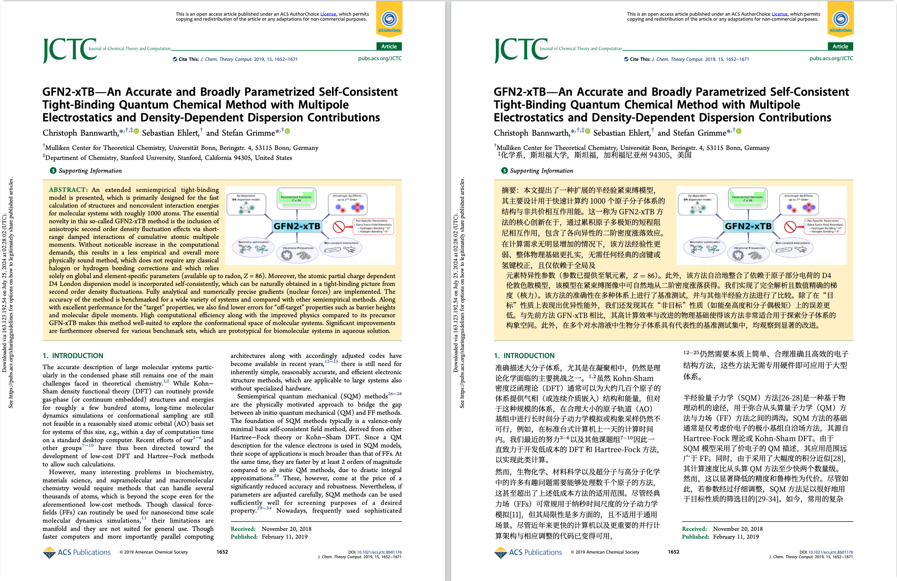
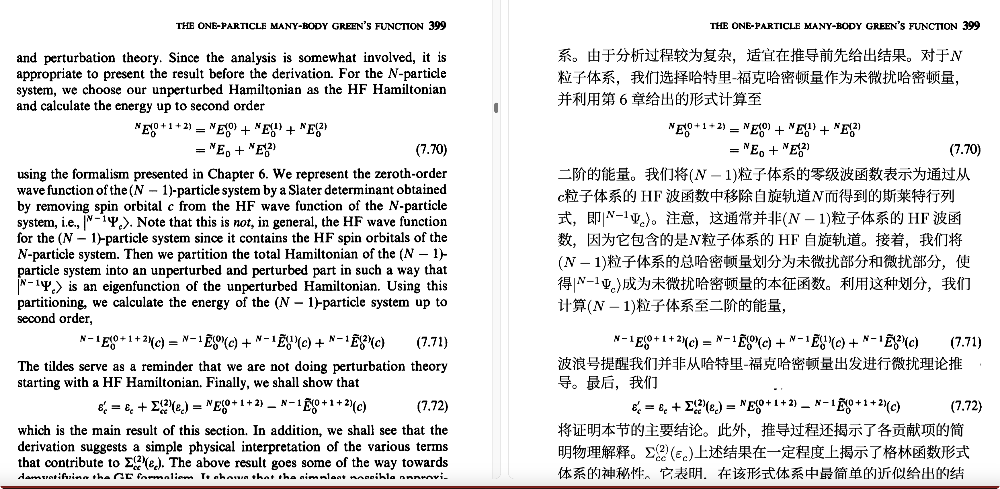

**痛点**

外文论文、教材、技术文档信息密度高，但读起来费劲：

- 原文阅读门槛高，效率低
- 普通翻译工具只吐纯文本，公式、图片、排版基本全崩
- 译后结果难整理、难分享、难归档

**RetainPDF 做的事**

上传 PDF，一键拿到保留原始排版的中文译文。

- 输出译文 PDF、Markdown、ZIP 打包，按需取用
- 网页端直接操作，也支持命令行和 API 接入
- 图片型 PDF（扫描件、截图版）同样能处理，不只限于可编辑 PDF

**翻译效果示意**

普通 SCI 论文翻译效果：



图片型 PDF 翻译对比效果：



**和同类方案比，好在哪**

- 对比 [PDFMathTranslate](https://github.com/PDFMathTranslate/PDFMathTranslate)：补上了图片型 PDF 的短板，行内公式与正文的衔接更自然，排版崩掉的概率明显低
- 对比 Doc2X 等闭源方案：可自主部署、自己掌控接口和结果文件；实测整体效果也更好
- 实测产出接近直接可用，不需要再手工修排版


# 小白用户

如果你只是想把服务跑起来，按下面步骤做就够了。

## 1. 先确认机器环境

建议环境：

- 系统：`Linux` 优先，推荐 `Ubuntu 22.04 / 24.04`
- CPU 架构：当前镜像按 `x86_64 / amd64` 构建，不是 ARM 版本
- CPU：至少 `4 核`
- 内存：至少 `8GB`，推荐 `16GB` 或更高
- 磁盘：至少预留 `10GB` 可用空间
- 网络：需要能访问 Docker Hub、MinerU 和你的模型 API

说明：

- 这个项目主要吃 CPU、内存和网络，不依赖独立显卡
- 如果你的机器是 `Mac M`、树莓派、ARM 服务器，请先确认是否具备 `x86_64` 兼容运行环境
- 如果只是轻量自用，`4 核 + 8GB` 可以起服务
- 如果你要多人同时用，建议从 `8 核 + 16GB` 起步

## 2. 安装 Docker

先确认系统里已经安装：

- `docker`
- `docker compose`

安装完成后，先自检：

```bash
docker --version
docker compose version
```

## 3. 拉取 GitHub 项目

```bash
git clone https://github.com/wxyhgk/retain-pdf.git
cd retain-pdf/docker/delivery
```

## 4. 启动服务

默认 OCR provider 是自托管 `local`（走 `docker/app.env` 里的 `RETAIN_LOCAL_*` 系列变量），需要你自己先在有 GPU 的机器上启动一个 PaddleX serving（`RETAIN_LOCAL_PADDLEX_URL` 默认指向 `http://host.docker.internal:8080`），否则 OCR 任务会失败。启动方式和踩坑点见下方 [docker/app.env](#dockerappenv) 一节；如果暂时没有自托管环境，把 `docker/web.env` 的 `FRONT_OCR_PROVIDER` 改回 `paddle` 即可继续用云端 PaddleOCR。

```bash
docker compose up -d
```

启动完成后，默认访问地址：

```text
http://127.0.0.1:40001
```

# 专业用户

## 文件作用

- `docker-compose.yml`
  Docker 编排入口。默认直接拉取 Docker Hub 镜像并启动 `app` + `web`。
- `docker/app.env`
  后端运行参数。控制容器内路径、字体、端口、并发、上传限制，以及自托管 PaddleX OCR 的 `RETAIN_LOCAL_*` 系列变量。
- `docker/web.env`
  Docker 公共版前端运行参数。控制前端默认注入的后端 key、模型默认值等。
- `docker/auth.local.json`
  Rust API 鉴权白名单。前端和 CLI 都需要用这里配置的后端 key 才能访问接口。

## 常见修改项

### docker/auth.local.json

- `api_keys`
  Rust API 允许访问的后端 key 列表。前端请求头里的 `X-API-Key` 必须命中这里的某一个值。
- `max_running_jobs`
  后端允许同时运行的任务数上限。
- `simple_port`
  multipart 扁平字段提交接口在容器内监听的端口，默认 `42000`。对外通常不直接暴露。

### docker/web.env

- `FRONT_API_BASE`
  前端内部使用的 API 基地址。通常留空，让前端自动走同源代理。
- `FRONT_X_API_KEY`
  前端自动附带给后端的 `X-API-Key`。必须和 `docker/auth.local.json` 中某个值一致。
- `FRONT_OCR_PROVIDER`
  前端默认 OCR provider。默认 `local`（自托管 PaddleX，见上方 [启动服务](#4-启动服务)），也可以填 `paddle`（云端 PaddleOCR）。

  **注意（老用户升级）：** 这个默认值只在浏览器从未保存过设置时生效。之前已经用过本项目、`localStorage` 里已经存过 `paddle` 选择的浏览器，不会自动切到 `local`——需要清一下站点数据（或手动清 `localStorage` 里的 `retainpdf.browserConfig` 之类的 key），或者等页面加上 provider 切换 UI 之后再改。
- `FRONT_PADDLE_TOKEN`
  前端默认带出的 Paddle token。留空时，最终用户自己在页面弹窗里填写。`FRONT_OCR_PROVIDER=local` 时不需要这个。
- `FRONT_MINERU_TOKEN`
  前端默认带出的 MinerU token。留空时，最终用户自己在页面弹窗里填写。
- `FRONT_MODEL_API_KEY`
  前端默认带出的模型 API key。留空时由最终用户自己填写。
- `FRONT_MODEL`
  前端默认模型名。默认走 OpenRouter，例如 `deepseek/deepseek-chat`。
- `FRONT_BASE_URL`
  前端默认模型服务地址。默认 `https://openrouter.ai/api/v1`（OpenRouter），也可以填 `https://api.deepseek.com/v1` 直连 DeepSeek。

### docker/app.env

- `PROJECT_ROOT`
  容器内项目根目录。
- `RUST_API_ROOT`
  容器内 Rust API 目录。
- `RUST_API_DATA_ROOT`
  Rust API 运行时数据根目录，主要放上传文件、任务目录、下载缓存和数据库。`RUST_API_DATA_DIR` 仅作为旧别名兼容。
- `OUTPUT_ROOT`
  任务输出目录。
- `PYTHON_BIN`
  后端调用 Python 脚本使用的解释器。
- `TYPST_BIN`
  Typst 可执行文件路径。
- `RETAIN_PDF_FONT_PATH`
  默认中文字体文件路径。
- `RETAIN_PDF_TYPST_FONT_FAMILY`
  Typst 默认字体族名称。
- `RUST_API_PORT`
  完整 API 在容器内监听的端口，默认 `41000`。
- `RUST_API_SIMPLE_PORT`
  multipart 扁平字段提交接口在容器内监听的端口，默认 `42000`。
- `RUST_API_MAX_RUNNING_JOBS`
  最大并发运行任务数。
- `RUST_API_UPLOAD_MAX_BYTES`
  后端普通上传大小限制，`0` 表示不限制；当前交付包建议写成 `209715200`。
- `RUST_API_UPLOAD_MAX_PAGES`
  后端普通上传页数限制，`0` 表示不限制；当前交付包建议写成 `300`。

## 说明

- 当前 compose 默认暴露：
  - `40001`：前端页面
  - `41000`：完整 Rust API
  - `42000`：multipart 扁平字段提交接口，只提供 `/health` 和 `POST /api/v1/translate/bundle`
- 前端通过同源代理访问后端；普通用户通常不需要手工理解 `API Base`
- 当前主线前端默认 OCR provider 是 `paddle`
- 页面里显示的大小 / 页数限制来自当前后端运行配置，不应再按旧的 MinerU 固定上游限制理解

## 可选默认值

如果你想让前端默认带出下游配置，可以继续填写：

- `FRONT_OCR_PROVIDER`
- `FRONT_PADDLE_TOKEN`
- `FRONT_MINERU_TOKEN`
- `FRONT_MODEL_API_KEY`
- `FRONT_MODEL`
- `FRONT_BASE_URL`

如果留空，最终用户需要在页面右上角的“API 配置”弹窗中自己填写。

## 如果要换成你自己的镜像版本

也可以这样启动：

```bash
APP_IMAGE=wxyhgk/retainpdf-app:<version> \
WEB_IMAGE=wxyhgk/retainpdf-web:<version> \
docker compose up -d
```

# 开发者

如果你想直接用 CLI 调接口，而不是走前端页面，可以按下面方式调用。

先约定几个变量：

```bash
export HOST="http://127.0.0.1:40001"
export X_API_KEY="replace-with-your-backend-key"
export OCR_PROVIDER="paddle"
export PADDLE_TOKEN="your-paddle-token"
export MINERU_TOKEN="your-mineru-token"
export MODEL_API_KEY="your-model-api-key"
export MODEL="deepseek-v4-flash"
export BASE_URL="https://api.deepseek.com/v1"
```

## 健康检查

```bash
curl "$HOST/health"
```

## 上传 PDF

```bash
curl -X POST "$HOST/api/v1/uploads" \
  -H "X-API-Key: $X_API_KEY" \
  -F "file=@/absolute/path/to/your.pdf"
```

返回里会拿到：

- `upload_id`
- `filename`
- `page_count`

## 创建异步任务

先把上一步返回的 `upload_id` 填进去：

```bash
curl -X POST "$HOST/api/v1/jobs" \
  -H "X-API-Key: $X_API_KEY" \
  -H "Content-Type: application/json" \
  -d '{
    "workflow": "book",
    "source": {
      "upload_id": "your-upload-id"
    },
    "ocr": {
      "provider": "'"$OCR_PROVIDER"'",
      "paddle_token": "'"$PADDLE_TOKEN"'",
      "mineru_token": "'"$MINERU_TOKEN"'"
    },
    "translation": {
      "api_key": "'"$MODEL_API_KEY"'",
      "model": "'"$MODEL"'",
      "base_url": "'"$BASE_URL"'",
      "mode": "sci"
    },
    "render": {
      "render_mode": "auto"
    },
    "runtime": {
      "workers": 100,
      "batch_size": 1,
      "classify_batch_size": 12,
      "compile_workers": 8,
      "timeout_seconds": 1800
    }
  }'
```

返回里会拿到：

- `job_id`
- `status`

## 查询任务状态

```bash
curl -H "X-API-Key: $X_API_KEY" \
  "$HOST/api/v1/jobs/your-job-id"
```

重点看这些字段：

- `status`
- `stage`
- `stage_detail`
- `progress`
- `actions`

任务终态通常是：

- `succeeded`
- `failed`
- `canceled`

## 下载结果

下载 PDF：

```bash
curl -L -H "X-API-Key: $X_API_KEY" \
  "$HOST/api/v1/jobs/your-job-id/pdf" \
  -o translated.pdf
```

下载 Markdown：

```bash
curl -L -H "X-API-Key: $X_API_KEY" \
  "$HOST/api/v1/jobs/your-job-id/markdown?raw=true" \
  -o translated.md
```

下载 ZIP：

```bash
curl -L -H "X-API-Key: $X_API_KEY" \
  "$HOST/api/v1/jobs/your-job-id/download" \
  -o result.zip
```

## 取消任务

```bash
curl -X POST -H "X-API-Key: $X_API_KEY" \
  "$HOST/api/v1/jobs/your-job-id/cancel"
```

## multipart 扁平提交接口

如果你不想自己先调用 `/api/v1/uploads`，可以直接上传 PDF 并创建异步任务。

注意：

- 这个接口是由前端同源代理转发的
- 默认路径是 `/api/v1/translate/bundle`
- 请求返回 `ApiResponse<JobSubmissionView>`，其中包含 `job_id` 和初始 `status`
- 接口不会等待 OCR / 翻译 / 渲染完成，也不会直接返回 ZIP
- 后续仍需轮询 `GET /api/v1/jobs/{job_id}`，完成后再下载 `/api/v1/jobs/{job_id}/download`

```bash
curl -X POST "$HOST/api/v1/translate/bundle" \
  -H "X-API-Key: $X_API_KEY" \
  -F "file=@/absolute/path/to/your.pdf" \
  -F "provider=$OCR_PROVIDER" \
  -F "paddle_token=$PADDLE_TOKEN" \
  -F "mineru_token=$MINERU_TOKEN" \
  -F "base_url=$BASE_URL" \
  -F "api_key=$MODEL_API_KEY" \
  -F "model=$MODEL" \
  -F "mode=sci" \
  -F "workers=100" \
  -F "batch_size=1"
```

说明：

- `provider` 建议显式传 `paddle` 或 `mineru`
- `paddle_token` / `mineru_token` 只需要传当前 `provider` 对应的那个
