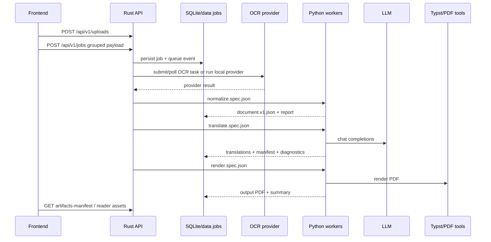

# Project Overview

Purpose: Trang nay giai thich RetainPDF la gi, he thong giai quyet bai toan nao, va nhung boundary nao da duoc xac minh tu source. Trang danh cho developer moi truoc khi di vao pipeline hoac API.

## Responsibilities

RetainPDF nhan PDF nguon, OCR/phan tich bo cuc, tao document trung gian, dich noi dung bang LLM, va render PDF dich co gang giu layout. Rust API quan ly HTTP, state, queue, SQLite, artifact index va library data; Python workers lam cac buoc document processing; frontend/desktop/Docker cung cap runtime surface.

RetainPDF khong phai mot OCR engine rieng tu codebase. OCR provider duoc cau hinh la MinerU, PaddleOCR hoac local command provider trong [`backend/config/ocr_providers.json`](../../../backend/config/ocr_providers.json). RetainPDF cung khong tu host LLM model; translation va AI Q&A goi provider tuong thich DeepSeek/OpenAI chat API qua config va credential.

## Key Files And Symbols

| Area | Files/symbols |
| --- | --- |
| Product entry | [`README.md`](../../../README.md), [`docker/delivery/docker-compose.yml`](../../../docker/delivery/docker-compose.yml) |
| Rust API | [`main.rs`](../../../backend/rust_api/src/main.rs), [`build_app()`](../../../backend/rust_api/src/app/router.rs), [`run_servers()`](../../../backend/rust_api/src/app/server.rs) |
| Job lifecycle | [`spawn_job()`](../../../backend/rust_api/src/job_runner/lifecycle.rs), [`PipelinePlan`](../../../backend/rust_api/src/job_runner/pipeline_plan.rs) |
| Python stages | [`run_normalize_ocr.py`](../../../backend/scripts/entrypoints/run_normalize_ocr.py), [`run_translate_only.py`](../../../backend/scripts/entrypoints/run_translate_only.py), [`run_render_only.py`](../../../backend/scripts/entrypoints/run_render_only.py) |
| UI/runtime | [`frontend/src/pages/home/entry.tsx`](../../../frontend/src/pages/home/entry.tsx), [`frontend/src/pages/reader/entry.tsx`](../../../frontend/src/pages/reader/entry.tsx), [`desktop/main.js`](../../../desktop/main.js) |

## How It Works

The main API exposes `/api/v1/jobs` for grouped job submissions and many library/artifact routes. The router is built in [`build_app()`](../../../backend/rust_api/src/app/router.rs), while a smaller multipart-style API is built by [`build_simple_app()`](../../../backend/rust_api/src/app/router.rs). Job creation resolves and validates a [`CreateJobInput`](../../../backend/rust_api/src/models/input/request.rs), which has grouped `source`, `ocr`, `translation`, `render`, and `runtime` sections.

When a job starts, [`spawn_job()`](../../../backend/rust_api/src/job_runner/lifecycle.rs) waits for a concurrency slot, dispatches by workflow, persists runtime state, then updates the library document/FTS index after successful non-OCR jobs. The full `book` flow is OCR -> translation -> render via [`PipelinePlan::book_with_ocr()`](../../../backend/rust_api/src/job_runner/pipeline_plan.rs).

Rust writes stage spec files through [`stage_specs.rs`](../../../backend/rust_api/src/worker_command/stage_specs.rs). Python stage entrypoints load those specs, write artifacts, and print stdout labels defined in [`contracts.py`](../../../backend/scripts/services/pipeline_shared/contracts.py). Rust parses those labels and registers artifacts under keys such as `source_pdf`, `normalized_document_json`, `translations_dir`, and `output_pdf`.

## Execution Flow

Source references: [`translation_flow.rs`](../../../backend/rust_api/src/job_runner/translation_flow.rs), [`ocr_flow/mod.rs`](../../../backend/rust_api/src/job_runner/ocr_flow/mod.rs), [`translate_only_pipeline.py`](../../../backend/scripts/services/translation/entrypoints/translate_only_pipeline.py), [`render_stage.py`](../../../backend/scripts/runtime/pipeline/render_stage.py).

## Configuration

Runtime config splits by surface:

| Surface | Config source |
| --- | --- |
| Rust API | [`AppConfig::from_env()`](../../../backend/rust_api/src/config.rs), [`config/*.rs`](../../../backend/rust_api/src/config) |
| OCR providers | [`ocr_providers.json`](../../../backend/config/ocr_providers.json), provider validation code |
| Frontend | [`runtime.ts`](../../../frontend/src/js/config/runtime.ts), [`docker/entrypoint-web.sh`](../../../docker/entrypoint-web.sh), [`frontend/runtime-config.js`](../../../frontend/runtime-config.js) |
| Desktop | [`buildBackendEnv()`](../../../desktop/src/main/backend-env.js), [`desktop/main.js`](../../../desktop/main.js) |
| Docker | [`app.env`](../../../docker/delivery/docker/app.env), [`web.env`](../../../docker/delivery/docker/web.env), [`auth.local.json`](../../../docker/delivery/docker/auth.local.json) |

## Failure Modes

Common failure categories are provider auth/limits, missing source artifacts, Python worker timeout/cancel, LLM credential errors, render failures, and API key mismatch. Rust classifies job failures in [`job_failure.rs`](../../../backend/rust_api/src/job_failure.rs), persists failure JSON on jobs, and exposes diagnostics routes in [`router.rs`](../../../backend/rust_api/src/app/router.rs). Python translation and render stages also write `pipeline_summary.json`, `pipeline_events.jsonl`, and diagnostics artifacts.

## Extension Points

Add workflow behavior in Rust job runner modules, add stage input/output contract in [`stage_specs.rs`](../../../backend/rust_api/src/worker_command/stage_specs.rs), and add Python handling in matching `backend/scripts/services/*` entrypoints. Add frontend workflow controls through home composition modules under [`frontend/src/pages/home/composition`](../../../frontend/src/pages/home/composition).

## Source References

- [`README.md`](../../../README.md)
- [`backend/rust_api/src/app/router.rs`](../../../backend/rust_api/src/app/router.rs)
- [`backend/rust_api/src/job_runner/lifecycle.rs`](../../../backend/rust_api/src/job_runner/lifecycle.rs)
- [`backend/scripts/services/pipeline_shared/contracts.py`](../../../backend/scripts/services/pipeline_shared/contracts.py)
- [`frontend/src/pages/reader/README.md`](../../../frontend/src/pages/reader/README.md)

## Related Pages

- [System architecture](../03-architecture/system-architecture.md)
- [Data flow](../03-architecture/data-flow.md)
- [API reference](../05-interfaces/api-reference.md)

