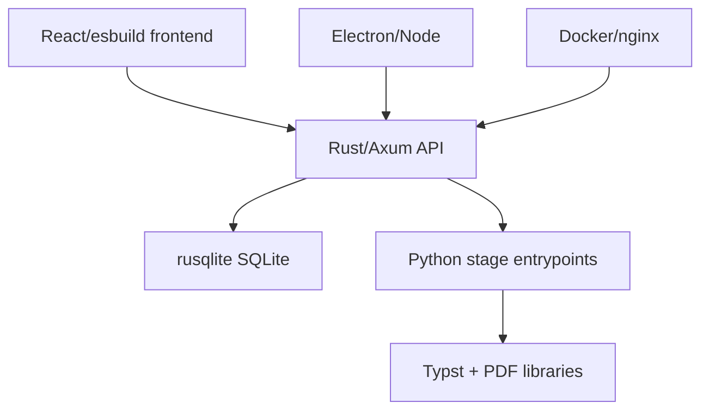

# Technology Stack

Purpose: Trang nay tom tat ngon ngu, framework, runtime va dependency quan trong. No giup developer hieu cach build/test/deploy tung component.

## Responsibilities

Stack duoc chia theo runtime: Rust cho control plane, Python cho document/LLM/PDF processing, React/TypeScript cho web UI, Electron/Node cho desktop, Docker/nginx cho delivery. SQLite la persistence chinh cho jobs/library/conversations.

## Key Files And Symbols

| Layer | Technology | Evidence |
| --- | --- | --- |
| API/control plane | Rust 2021, Axum, Tokio, Tower, rusqlite | [`Cargo.toml`](../../../backend/rust_api/Cargo.toml), [`main.rs`](../../../backend/rust_api/src/main.rs) |
| Python workers | Python `>=3.11,<3.12`, PyMuPDF, pikepdf, Pillow, requests | [`pyproject.toml`](../../../pyproject.toml), [`docker/requirements-app.txt`](../../../docker/requirements-app.txt) |
| Rendering | Typst, PyMuPDF, pikepdf, font assets | [`Dockerfile.app`](../../../docker/Dockerfile.app), [`book_renderer.py`](../../../backend/scripts/services/rendering/output/typst/book_renderer.py) |
| Web UI | React 19, esbuild, Tailwind, pdfjs-dist, assistant-ui | [`frontend/package.json`](../../../frontend/package.json), [`build-js-bundle.mjs`](../../../frontend/scripts/build-js-bundle.mjs) |
| Migration UI | Vite, React, TypeScript | [`frontend-react/package.json`](../../../frontend-react/package.json), [`vite.config.ts`](../../../frontend-react/vite.config.ts) |
| Desktop | Electron, electron-builder, Node scripts | [`desktop/package.json`](../../../desktop/package.json), [`desktop/main.js`](../../../desktop/main.js) |
| Containers | Docker multi-stage builds, nginx reverse proxy | [`Dockerfile.app`](../../../docker/Dockerfile.app), [`Dockerfile.web`](../../../docker/Dockerfile.web), [`nginx.conf.template`](../../../docker/nginx.conf.template) |

## How It Works

Rust uses Axum routes and Tokio async runtime. The router applies `auth::require_api_key` to `/api/v1/*` and exposes unauthenticated `/health`; this is defined in [`build_app()`](../../../backend/rust_api/src/app/router.rs). Persistence is SQLite through rusqlite, with WAL/busy timeout setup and migrations in [`db.rs`](../../../backend/rust_api/src/db.rs) and [`db/schema.rs`](../../../backend/rust_api/src/db/schema.rs).

Python code is packaged as `retainpdf-core` console scripts in [`backend/packages/retainpdf-core/pyproject.toml`](../../../backend/packages/retainpdf-core/pyproject.toml), while the deployed path normally runs script entrypoints generated in stage command specs. `pyproject.toml` lists runtime dependencies and declares Typst as required external binary.

The production frontend builds bundled JavaScript through esbuild. [`build-js-bundle.mjs`](../../../frontend/scripts/build-js-bundle.mjs) produces `app.bundle.js`, `detail.bundle.js`, and `reader.bundle.js`. The reader uses pdf.js assets copied either by frontend preparation or desktop packaging.

## Execution Or Data Flow

Source references: [`Cargo.toml`](../../../backend/rust_api/Cargo.toml), [`pyproject.toml`](../../../pyproject.toml), [`frontend/package.json`](../../../frontend/package.json), [`desktop/package.json`](../../../desktop/package.json).

## Configuration

Major default ports are code/config backed: Rust API `41000`, simple API `42000`, retainpdf-ai `41100`, Docker web default `40001`. Rust reads `RUST_API_PORT` and `RUST_API_SIMPLE_PORT` in [`server.rs`](../../../backend/rust_api/src/config/server.rs) and [`auth.rs`](../../../backend/rust_api/src/config/auth.rs); Docker maps ports in [`docker-compose.yml`](../../../docker/delivery/docker-compose.yml); Electron hardcodes local ports in [`desktop/main.js`](../../../desktop/main.js).

## Failure Modes

Version mismatches can break cross-runtime execution: Python code expects 3.11, Docker app installs Typst 0.14.2, frontend build expects Node 22 in Docker, and desktop packaging verifies bundled Python imports in [`prepare-app.mjs`](../../../desktop/scripts/prepare-app.mjs). Missing Typst/fonts produce render/desktop startup failures; missing API keys produce Rust auth or provider/LLM failures.

## Extension Points

Add Rust dependencies in [`backend/rust_api/Cargo.toml`](../../../backend/rust_api/Cargo.toml); add Python dependencies in [`pyproject.toml`](../../../pyproject.toml) and container requirements if needed; add frontend dependencies in [`frontend/package.json`](../../../frontend/package.json); add desktop runtime assets through [`desktop/scripts/prepare-app.mjs`](../../../desktop/scripts/prepare-app.mjs).

## Source References

- [`backend/rust_api/Cargo.toml`](../../../backend/rust_api/Cargo.toml)
- [`pyproject.toml`](../../../pyproject.toml)
- [`frontend/package.json`](../../../frontend/package.json)
- [`desktop/package.json`](../../../desktop/package.json)
- [`docker/Dockerfile.web`](../../../docker/Dockerfile.web)

## Related Pages

- [Repository structure](repository-structure.md)
- [Prerequisites](../02-getting-started/prerequisites.md)
- [Deployment](../06-operations/deployment.md)

