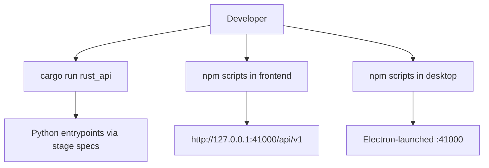

# Local Development

Purpose: Trang nay huong dan cach suy nghi ve cac che do chay local cua RetainPDF. No uu tien source-grounded commands va boundaries thay vi gia dinh script khong ton tai.

## Responsibilities

Local development co ba surface chinh: Rust API, frontend web, va Electron desktop. Python workers duoc Rust API goi theo stage spec; co the chay truc tiep entrypoint khi debug, nhung normal path la thong qua job runner. Docker delivery la cach chay gan production nhat.

## Key Files And Symbols

| Task | Source |
| --- | --- |
| Rust API binary | [`backend/rust_api/src/main.rs`](../../../backend/rust_api/src/main.rs), [`Cargo.toml`](../../../backend/rust_api/Cargo.toml) |
| Python stage scripts | [`backend/scripts/entrypoints`](../../../backend/scripts/entrypoints) |
| Frontend build/dev scripts | [`frontend/package.json`](../../../frontend/package.json), [`build-js-bundle.mjs`](../../../frontend/scripts/build-js-bundle.mjs) |
| Desktop scripts | [`desktop/package.json`](../../../desktop/package.json), [`desktop/main.js`](../../../desktop/main.js) |
| Docker compose | [`docker/delivery/docker-compose.yml`](../../../docker/delivery/docker-compose.yml) |

## How It Works

The Rust binary reads environment via [`AppConfig::from_env()`](../../../backend/rust_api/src/config.rs), creates runtime directories, initializes SQLite and serves both full and simple APIs through [`run_servers()`](../../../backend/rust_api/src/app/server.rs). For local development, make sure `RUST_API_KEYS` or `auth.local.json` exists before hitting `/api/v1/*`.

Frontend runtime config comes from `window.__FRONT_RUNTIME_CONFIG__` in [`runtime.ts`](../../../frontend/src/js/config/runtime.ts). In Docker web, [`entrypoint-web.sh`](../../../docker/entrypoint-web.sh) writes that object. In local web, `frontend/runtime-config.js` and optional local config drive API base/key.

Desktop development uses Electron to start the bundled backend path under `desktop/app/backend`; `npm run prepare` in desktop package populates that bundle through [`prepare-app.mjs`](../../../desktop/scripts/prepare-app.mjs). [`desktop/main.js`](../../../desktop/main.js) can reuse an existing backend on `41000` in development if it passes health and jobs API checks.

## Execution Or Data Flow

Source references: [`frontend/src/js/config/runtime.ts`](../../../frontend/src/js/config/runtime.ts), [`desktop/src/main/backend-http.js`](../../../desktop/src/main/backend-http.js), [`worker_command/entrypoints.rs`](../../../backend/rust_api/src/worker_command/entrypoints.rs).

## Configuration

Minimal local backend config:

| Variable/file | Meaning | Source |
| --- | --- | --- |
| `RUST_API_KEYS` or `auth.local.json` | API auth keys | [`auth.rs`](../../../backend/rust_api/src/config/auth.rs) |
| `RUST_API_DATA_ROOT` | SQLite/data/jobs root | [`paths.rs`](../../../backend/rust_api/src/config/paths.rs) |
| `RUST_API_SCRIPTS_DIR` | Python scripts directory | [`paths.rs`](../../../backend/rust_api/src/config/paths.rs) |
| `PYTHON_BIN` | Python command used by workers | [`config.rs`](../../../backend/rust_api/src/config.rs), [`worker_command/entrypoints.rs`](../../../backend/rust_api/src/worker_command/entrypoints.rs) |
| `TYPST_BIN`, font envs | Render runtime | [`Dockerfile.app`](../../../docker/Dockerfile.app), [`backend-env.js`](../../../desktop/src/main/backend-env.js) |

## Failure Modes

If frontend cannot reach API, verify `runtimeConfig.apiBase` and `xApiKey`. If Rust starts but jobs fail, inspect job detail, events, `pipeline_events.jsonl`, and worker stderr captured by job runner. If desktop fails before main window, inspect the desktop log path emitted by [`desktop/main.js`](../../../desktop/main.js).

## Extension Points

For a new local command, add it to the owning package manifest (`frontend/package.json`, `desktop/package.json`, Rust Cargo scripts through standard cargo), and document required env in [Configuration](configuration.md). For new Python worker entrypoint, update Rust [`worker_command/entrypoints.rs`](../../../backend/rust_api/src/worker_command/entrypoints.rs) and package console scripts if console mode must support it.

## Source References

- [`backend/rust_api/src/app/server.rs`](../../../backend/rust_api/src/app/server.rs)
- [`frontend/src/js/config/runtime.ts`](../../../frontend/src/js/config/runtime.ts)
- [`desktop/main.js`](../../../desktop/main.js)
- [`docker/delivery/docker-compose.yml`](../../../docker/delivery/docker-compose.yml)

## Related Pages

- [Prerequisites](prerequisites.md)
- [Configuration](configuration.md)
- [Troubleshooting](troubleshooting.md)

