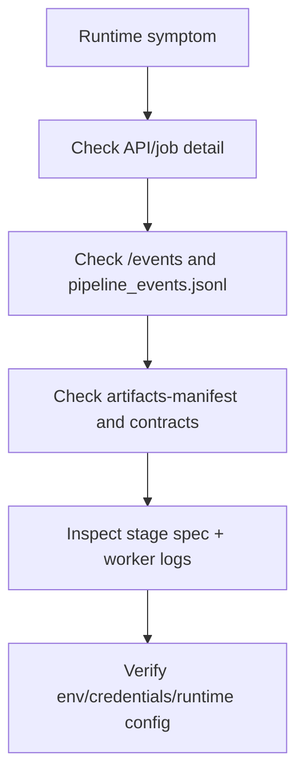

# Troubleshooting

Purpose: Trang nay lien ket trieu chung thuong gap voi source path va diagnostics that. No danh cho developer/debugger khi job, UI, Docker hoac desktop khong hoat dong.

## Responsibilities

Troubleshooting tap trung vao cac loi da co code path xu ly: auth/API key, provider token/limits, missing artifacts, worker timeout/cancel, render runtime, frontend runtime config, AI proxy/service, desktop startup. No khong thay the logs thuc te cua job hay container.

## Key Files And Symbols

| Symptom area | Source |
| --- | --- |
| API auth | [`auth.rs`](../../../backend/rust_api/src/config/auth.rs), [`auth::require_api_key`](../../../backend/rust_api/src/auth.rs) |
| Job failures | [`job_failure.rs`](../../../backend/rust_api/src/job_failure.rs), [`process_runner.rs`](../../../backend/rust_api/src/job_runner/process_runner.rs) |
| Artifact readiness | [`stage_contract.rs`](../../../backend/rust_api/src/job_runner/stage_contract.rs), [`presentation/contracts.rs`](../../../backend/rust_api/src/services/jobs/presentation/contracts.rs) |
| Pipeline stdout/artifacts | [`stdout_parser`](../../../backend/rust_api/src/job_runner/stdout_parser), [`contracts.py`](../../../backend/scripts/services/pipeline_shared/contracts.py) |
| Frontend config/API | [`runtime.ts`](../../../frontend/src/js/config/runtime.ts), [`http.ts`](../../../frontend/src/js/api/http.ts) |
| Desktop startup | [`desktop/main.js`](../../../desktop/main.js), [`backend-startup-diagnostics.js`](../../../desktop/src/main/backend-startup-diagnostics.js) |

## How It Works

Rust persists events in SQLite and exposes them through `/api/v1/jobs/:job_id/events`. Python stages emit `pipeline_events.jsonl` and `pipeline_summary.json` using stdout labels in [`contracts.py`](../../../backend/scripts/services/pipeline_shared/contracts.py). Rust's stdout parser maps labels and artifact-published events into job artifact state and the artifact manifest.

The artifact contract view in [`presentation/contracts.rs`](../../../backend/rust_api/src/services/jobs/presentation/contracts.rs) checks readiness for `ocr_ready_for_translation`, `translation_ready_for_render`, and `render_complete`. Use it when a resume/retry/render flow complains about missing inputs.

## Common Failure Modes

| Symptom | Likely cause | What to inspect |
| --- | --- | --- |
| `401` from `/api/v1/*` | `X-API-Key` mismatch or missing `RUST_API_KEYS` | [`auth.rs`](../../../backend/rust_api/src/config/auth.rs), frontend [`buildApiHeaders()`](../../../frontend/src/js/config/runtime.ts), Docker [`web.env`](../../../docker/delivery/docker/web.env) |
| Job stays queued | `RUST_API_MAX_RUNNING_JOBS` semaphore full or canceled before slot | [`wait_for_execution_slot()`](../../../backend/rust_api/src/job_runner/execution_queue.rs), [`lifecycle.rs`](../../../backend/rust_api/src/job_runner/lifecycle.rs) |
| OCR submit/poll fails | Provider token, base URL, file/page limit, provider status error | [`ocr_flow/paddle.rs`](../../../backend/rust_api/src/job_runner/ocr_flow/paddle.rs), [`ocr_flow/mineru.rs`](../../../backend/rust_api/src/job_runner/ocr_flow/mineru.rs), [`provider.rs`](../../../backend/rust_api/src/config/provider.rs) |
| Translation fails immediately | Missing LLM API key/base URL validation or worker credential env | [`stage_specs.rs`](../../../backend/rust_api/src/worker_command/stage_specs.rs), [`translate_only_pipeline.py`](../../../backend/scripts/services/translation/entrypoints/translate_only_pipeline.py) |
| Render-only fails | `source.artifact_job_id` missing or translation manifest missing | [`prepare_render_input()`](../../../backend/rust_api/src/services/jobs/creation/prepare.rs), [`render_inputs.py`](../../../backend/scripts/runtime/pipeline/render_inputs.py) |
| Reader loads no PDF | Artifact manifest lacks source/translated PDF or protected download failed | [`useReaderSession()`](../../../frontend/src/pages/reader/hooks/use-reader-session.ts), [`jobs-artifacts.ts`](../../../frontend/src/js/api/jobs-artifacts.ts) |
| `/api/v1/ai/ask` returns 502 | retainpdf-ai not running or wrong `RUST_API_AI_SERVICE_BASE` | [`ai_proxy.rs`](../../../backend/rust_api/src/routes/ai_proxy.rs), [`retainpdf_ai/app.py`](../../../backend/ai_service/retainpdf_ai/app.py) |
| Docker web whitescreen | `runtime-config.local.js` missing or runtime config not JS | [`entrypoint-web.sh`](../../../docker/entrypoint-web.sh) |
| Desktop startup fails | Missing bundled Rust binary/Python/scripts/Typst or busy ports | [`desktop/main.js`](../../../desktop/main.js), [`prepare-app.mjs`](../../../desktop/scripts/prepare-app.mjs) |

## Execution Or Data Flow

## Configuration

For Docker, verify `docker/delivery/docker/auth.local.json`, `app.env`, and `web.env` agree on backend key and ports. For desktop, verify the desktop log path printed by `desktop/main.js` and the port checks around `41000`, `42000`, and `41100`.

## Extension Points

Improve diagnosis by adding failure classification in [`job_failure.rs`](../../../backend/rust_api/src/job_failure.rs), new artifact readiness checks in [`presentation/contracts.rs`](../../../backend/rust_api/src/services/jobs/presentation/contracts.rs), or frontend error hints near API callers such as [`http.ts`](../../../frontend/src/js/api/http.ts) and [`ai.ts`](../../../frontend/src/js/api/ai.ts).

## Source References

- [`backend/rust_api/src/job_failure.rs`](../../../backend/rust_api/src/job_failure.rs)
- [`backend/rust_api/src/job_runner/process_runner.rs`](../../../backend/rust_api/src/job_runner/process_runner.rs)
- [`frontend/src/js/api/http.ts`](../../../frontend/src/js/api/http.ts)
- [`desktop/main.js`](../../../desktop/main.js)

## Related Pages

- [Runtime lifecycle](../03-architecture/runtime-lifecycle.md)
- [Observability](../06-operations/observability.md)
- [Security](../06-operations/security.md)

