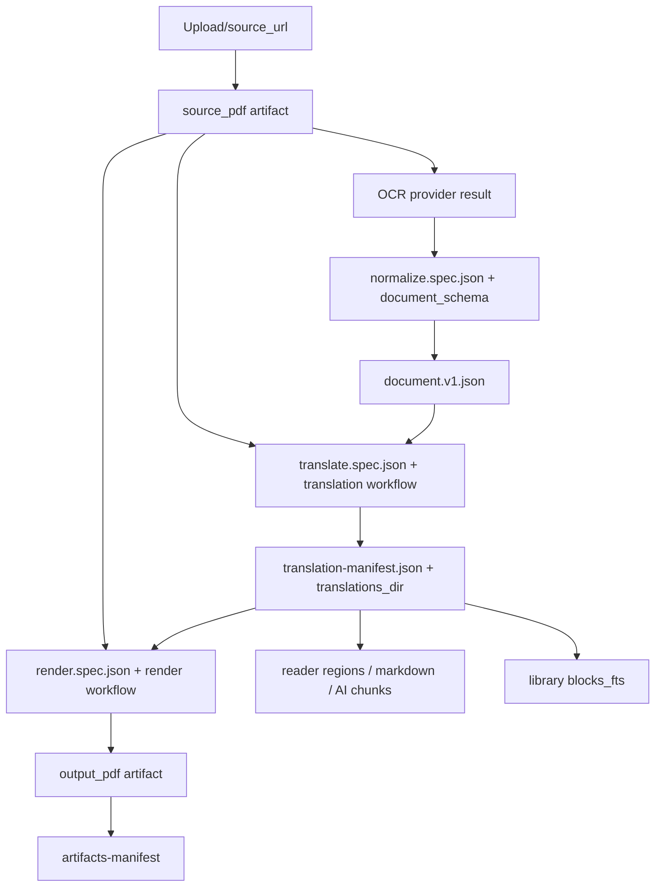

# Data Flow

Purpose: Trang nay theo doi du lieu tu PDF dau vao den PDF/Markdown/reader/AI dau ra. No danh cho developer debug pipeline hoac them artifact moi.

## Responsibilities

Data flow chinh gom: upload/source, OCR provider result, normalized `document.v1`, translation artifacts, render artifacts, library index, reader assets, and AI citations. Rust la owner cua job state va artifact index; Python la owner cua transformations.

## Key Files And Symbols

| Data stage | Source |
| --- | --- |
| Upload/source | [`routes/uploads.rs`](../../../backend/rust_api/src/routes/uploads.rs), [`ocr_flow/artifacts.rs`](../../../backend/rust_api/src/job_runner/ocr_flow/artifacts.rs) |
| Stage paths/artifact keys | [`storage_paths/constants.rs`](../../../backend/rust_api/src/storage_paths/constants.rs), [`registry.rs`](../../../backend/rust_api/src/storage_paths/registry.rs) |
| Normalized doc | [`normalize_pipeline.py`](../../../backend/scripts/services/document_schema/normalize_pipeline.py), [`document.v1.schema.json`](../../../backend/scripts/services/document_schema/document.v1.schema.json) |
| Translation output | [`execution_runner.py`](../../../backend/scripts/services/translation/workflow/execution_runner.py), [`translate_only_pipeline.py`](../../../backend/scripts/services/translation/entrypoints/translate_only_pipeline.py) |
| Render output | [`render_stage.py`](../../../backend/scripts/runtime/pipeline/render_stage.py), [`executor.py`](../../../backend/scripts/services/rendering/workflow/executor.py) |
| Library FTS | [`update_document_after_job()`](../../../backend/rust_api/src/job_runner/lifecycle.rs), [`documents.rs`](../../../backend/rust_api/src/db/documents.rs) |

## How It Works

The job root has named directories such as `source`, `ocr`, `translated`, `rendered`, `artifacts`, `logs`, `specs`, and `typst`; these names are centralized in [`storage_paths/constants.rs`](../../../backend/rust_api/src/storage_paths/constants.rs). Python stages publish expected file names and stdout labels. Rust registers artifacts into `job_artifact_entries` during job persistence through [`db/job_writes.rs`](../../../backend/rust_api/src/db/job_writes.rs) and [`storage_paths/registry.rs`](../../../backend/rust_api/src/storage_paths/registry.rs).

Normalization writes `ocr/normalized/document.v1.json` and `document.v1.report.json` using schema/version constants in [`version.py`](../../../backend/scripts/services/document_schema/version.py). Translation writes page translations, `translation-manifest.json`, diagnostics and pipeline summary. Rendering reads the translation manifest and source PDF, then writes output PDF and render diagnostics.

## End-To-End Flow

Source references: [`stage_specs.rs`](../../../backend/rust_api/src/worker_command/stage_specs.rs), [`contracts.py`](../../../backend/scripts/services/pipeline_shared/contracts.py), [`presentation/contracts.rs`](../../../backend/rust_api/src/services/jobs/presentation/contracts.rs).

## Configuration

Data root is configured by `RUST_API_DATA_ROOT` or `RUST_API_DATA_DIR` in [`paths.rs`](../../../backend/rust_api/src/config/paths.rs). Docker sets `RUST_API_DATA_ROOT=/data` and `OUTPUT_ROOT=/data/jobs` in [`app.env`](../../../docker/delivery/docker/app.env) and [`Dockerfile.app`](../../../docker/Dockerfile.app). Desktop uses `app.getPath("userData")/data` in [`desktop/main.js`](../../../desktop/main.js).

## Failure Modes

Missing source PDF blocks OCR or render. Missing `normalized_document_json` blocks translation reuse. Missing `translation-manifest.json` blocks render. The readiness checks are in [`stage_contract.rs`](../../../backend/rust_api/src/job_runner/stage_contract.rs) and API-facing contract presentation in [`presentation/contracts.rs`](../../../backend/rust_api/src/services/jobs/presentation/contracts.rs).

If Python writes an output but does not print the expected stdout label or artifact-published event, Rust may not index it. Labels are shared in [`contracts.py`](../../../backend/scripts/services/pipeline_shared/contracts.py) and parsed in [`stdout_parser`](../../../backend/rust_api/src/job_runner/stdout_parser).

## Extension Points

To add a new artifact:

1. Add/confirm artifact key and resolver in `storage_paths`.
2. Ensure Python writes the file under job root.
3. Print a known label or artifact-published event.
4. Add route/download/manifest presentation if frontend needs it.
5. Update data model and reader/frontend clients if consumed in UI.

## Source References

- [`backend/rust_api/src/storage_paths/constants.rs`](../../../backend/rust_api/src/storage_paths/constants.rs)
- [`backend/rust_api/src/storage_paths/registry.rs`](../../../backend/rust_api/src/storage_paths/registry.rs)
- [`backend/scripts/services/document_schema/normalize_pipeline.py`](../../../backend/scripts/services/document_schema/normalize_pipeline.py)
- [`backend/scripts/services/translation/entrypoints/translate_only_pipeline.py`](../../../backend/scripts/services/translation/entrypoints/translate_only_pipeline.py)
- [`backend/scripts/runtime/pipeline/render_stage.py`](../../../backend/scripts/runtime/pipeline/render_stage.py)

## Related Pages

- [Runtime lifecycle](runtime-lifecycle.md)
- [Cross-runtime contracts](../05-interfaces/cross-runtime-contracts.md)
- [Data models](../05-interfaces/data-models.md)
