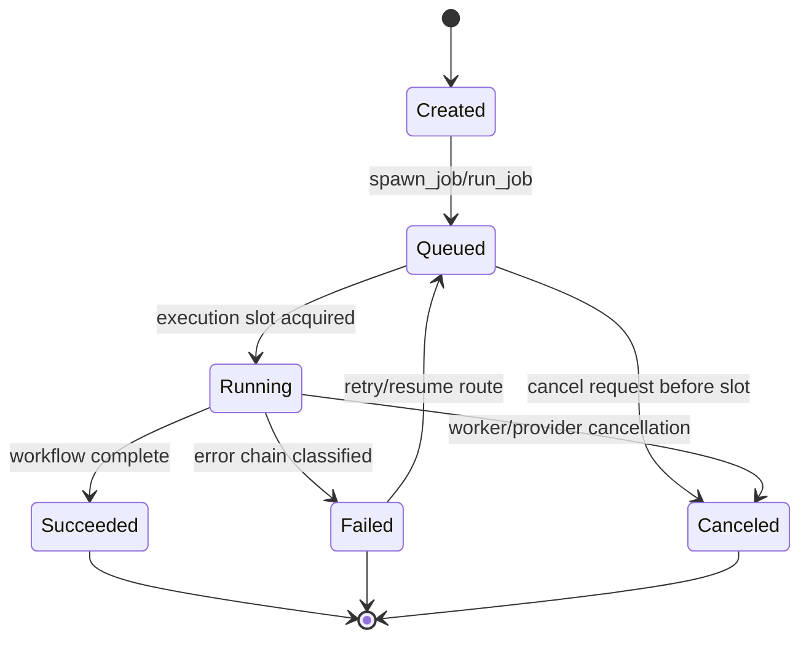
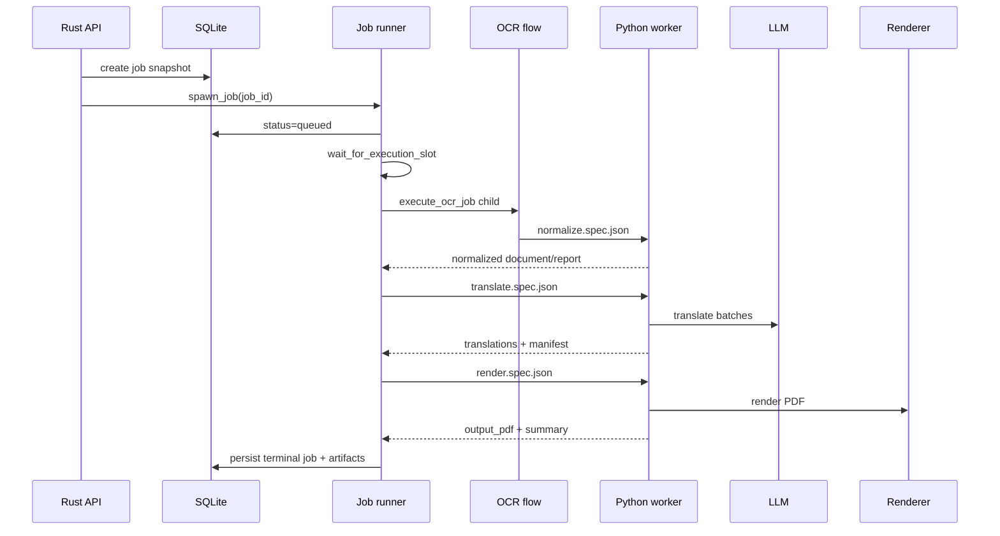

# Runtime Lifecycle

Purpose: Trang nay mo ta lifecycle cua API process, job execution va desktop/container runtime. No danh cho backend developer va operator can debug trang thai.

## Responsibilities

Runtime lifecycle co ba cap: process startup, job lifecycle, va stage lifecycle. Process startup tao config/state/server. Job lifecycle queue -> running -> terminal. Stage lifecycle lay input artifacts, viet spec, launch worker/provider, parse output, persist artifacts.

## Key Files And Symbols

| Lifecycle area | Source |
| --- | --- |
| API startup | [`main.rs`](../../../backend/rust_api/src/main.rs), [`server.rs`](../../../backend/rust_api/src/app/server.rs) |
| State init | [`build_state()`](../../../backend/rust_api/src/app/state.rs) |
| Job spawn/run | [`spawn_job()`](../../../backend/rust_api/src/job_runner/lifecycle.rs), [`run_job()`](../../../backend/rust_api/src/job_runner/lifecycle.rs) |
| Queue/concurrency | [`execution_queue.rs`](../../../backend/rust_api/src/job_runner/execution_queue.rs), [`AppState`](../../../backend/rust_api/src/app/state.rs) |
| Stage dispatch | [`dispatch_workflow()`](../../../backend/rust_api/src/job_runner/lifecycle.rs) |
| Worker process | [`process_runner.rs`](../../../backend/rust_api/src/job_runner/process_runner.rs), [`worker_process.rs`](../../../backend/rust_api/src/job_runner/worker_process.rs) |
| Desktop startup | [`desktop/main.js`](../../../desktop/main.js) |

## How It Works

At server startup, Rust builds [`AppState`](../../../backend/rust_api/src/app/state.rs), initializes DB, reconciles stale running jobs, cleans legacy workflows, and creates a semaphore from `max_running_jobs`. [`run_servers()`](../../../backend/rust_api/src/app/server.rs) starts full and simple API listeners and retention cleanup.

When a job is created, Rust persists it and calls [`spawn_job()`](../../../backend/rust_api/src/job_runner/lifecycle.rs). `run_job()` marks it queued, waits for an execution slot, dispatches the workflow, persists runtime job with artifacts, updates library data after terminal success, and clears cancellation state.

Workflows:

| Workflow | Runtime path | Source |
| --- | --- | --- |
| `ocr` | OCR provider + normalization | [`execute_ocr_job()`](../../../backend/rust_api/src/job_runner/ocr_flow/mod.rs) |
| `translate` | OCR + translation, or translate from existing OCR artifacts | [`run_translate_only_job_with_ocr()`](../../../backend/rust_api/src/job_runner/translation_flow.rs) |
| `render` | Render from existing translation artifacts | [`run_render_job_from_artifacts()`](../../../backend/rust_api/src/job_runner/render_flow.rs) |
| `book` | OCR + translation + render | [`run_translation_job_with_ocr()`](../../../backend/rust_api/src/job_runner/translation_flow.rs) |

## State Transition

Source references: [`lifecycle.rs`](../../../backend/rust_api/src/job_runner/lifecycle.rs), [`models/job/stage.rs`](../../../backend/rust_api/src/models/job/stage.rs), [`jobs-actions routes`](../../../backend/rust_api/src/routes/jobs).

## Sequence: Book Job

## Configuration

Concurrency is controlled by `RUST_API_MAX_RUNNING_JOBS` read in [`auth.rs`](../../../backend/rust_api/src/config/auth.rs) and stored on [`AppState`](../../../backend/rust_api/src/app/state.rs). Worker shutdown/timeout behavior is configured in [`job_runner.rs`](../../../backend/rust_api/src/config/job_runner.rs). Python entrypoint mode is configured by `RUST_API_PYTHON_ENTRYPOINT_MODE` in [`config.rs`](../../../backend/rust_api/src/config.rs).

## Failure Modes

`run_job()` catches dispatch errors and persists failed jobs unless already canceled. [`persist_failed_job()`](../../../backend/rust_api/src/job_runner/lifecycle.rs) writes status, stage, error, finished timestamp and failure classification. Worker process failures, timeouts, cancellation and credential redaction are handled under [`process_runner.rs`](../../../backend/rust_api/src/job_runner/process_runner.rs).

## Extension Points

Add a new workflow kind only if you update request models, validation, dispatch, pipeline plan, tests, API/frontend payload builders and stage contracts. For a new stage inside existing workflow, update Rust job runner stage code, stage specs, Python entrypoint, artifact registry, and resume/retry logic.

## Source References

- [`backend/rust_api/src/app/server.rs`](../../../backend/rust_api/src/app/server.rs)
- [`backend/rust_api/src/app/state.rs`](../../../backend/rust_api/src/app/state.rs)
- [`backend/rust_api/src/job_runner/lifecycle.rs`](../../../backend/rust_api/src/job_runner/lifecycle.rs)
- [`backend/rust_api/src/job_runner/translation_flow.rs`](../../../backend/rust_api/src/job_runner/translation_flow.rs)

## Related Pages

- [Rust API and job runner](../04-components/rust-api-and-job-runner.md)
- [Data flow](data-flow.md)
- [Troubleshooting](../02-getting-started/troubleshooting.md)

