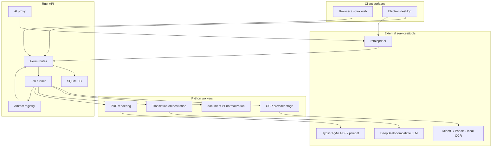

# System Architecture

Purpose: Trang nay mo ta kien truc tong the cua RetainPDF theo runtime va trach nhiem. No danh cho developer can hieu toan he thong truoc khi sua mot component.

## Responsibilities

Architecture tach control plane va processing plane. Rust API la control plane: auth, HTTP routes, job queue/lifecycle, persistence, artifact manifests, library/index data, AI proxy. Python scripts la processing plane: OCR normalization, translation orchestration, rendering. Frontend va Electron la presentation/runtime surface. Docker dong goi app va web container.

## Key Files And Symbols

| Concern | Source |
| --- | --- |
| Full API router | [`build_app()`](../../../backend/rust_api/src/app/router.rs) |
| Simple API router | [`build_simple_app()`](../../../backend/rust_api/src/app/router.rs) |
| Server startup | [`run_servers()`](../../../backend/rust_api/src/app/server.rs) |
| Shared app state | [`AppState`](../../../backend/rust_api/src/app/state.rs) |
| Job lifecycle | [`spawn_job()`](../../../backend/rust_api/src/job_runner/lifecycle.rs) |
| Stage specs | [`stage_specs.rs`](../../../backend/rust_api/src/worker_command/stage_specs.rs) |
| Python stdout contract | [`contracts.py`](../../../backend/scripts/services/pipeline_shared/contracts.py) |
| Frontend runtime config | [`runtime.ts`](../../../frontend/src/js/config/runtime.ts) |
| Desktop launcher | [`desktop/main.js`](../../../desktop/main.js) |

## How It Works

The Rust binary starts from [`main.rs`](../../../backend/rust_api/src/main.rs), reads [`AppConfig::from_env()`](../../../backend/rust_api/src/config.rs), initializes shared state with SQLite and runtime directories, then serves full and simple routers concurrently in [`server.rs`](../../../backend/rust_api/src/app/server.rs). Full API routes are protected by `auth::require_api_key`; `/health` remains outside that API route layer.

Processing is stage-based. Rust creates or resumes jobs, writes stage spec JSON, launches Python worker processes, parses stdout labels, updates job snapshots, persists artifact entries, and exposes those artifacts to frontend/reader. Python never owns long-lived job state; it receives explicit specs and writes files under job root.

retainpdf-ai is a separate FastAPI process. Frontend talks to Rust `/api/v1/ai/ask`, Rust proxies to retainpdf-ai with the same `X-API-Key`, and retainpdf-ai calls back to Rust for documents/search/conversation persistence.

## System Diagram

Source references: [`router.rs`](../../../backend/rust_api/src/app/router.rs), [`lifecycle.rs`](../../../backend/rust_api/src/job_runner/lifecycle.rs), [`desktop/main.js`](../../../desktop/main.js), [`retainpdf_ai/app.py`](../../../backend/ai_service/retainpdf_ai/app.py).

## Execution Or Data Flow

The core flow is asynchronous: API call returns a job record, while worker execution progresses in background. Frontend polls/listens through job detail, events, manifests and reader routes. Rust saves durable job state in SQLite and file artifacts under `data/jobs/<job_id>`.

## Configuration

System-level config belongs to:

- Rust: `RUST_API_*`, provider limits/timeouts, auth, paths in [`backend/rust_api/src/config`](../../../backend/rust_api/src/config).
- Python stage: spec files written by Rust, plus credential env refs.
- Frontend: `window.__FRONT_RUNTIME_CONFIG__` read in [`runtime.ts`](../../../frontend/src/js/config/runtime.ts).
- Desktop: generated env in [`backend-env.js`](../../../desktop/src/main/backend-env.js).
- Docker: app/web env and nginx proxy in [`docker/delivery/docker`](../../../docker/delivery/docker).

## Failure Modes

Architecture-level failures usually appear at boundaries: wrong API key, wrong runtime paths, missing stage artifact, Python worker exit, provider timeout, render tool missing, AI proxy upstream down. Rust persists failure state and logs error chains in [`lifecycle.rs`](../../../backend/rust_api/src/job_runner/lifecycle.rs) and classifies them in [`job_failure.rs`](../../../backend/rust_api/src/job_failure.rs).

## Extension Points

Add a new route in Rust router/services, a new processing stage in Rust job runner plus Python entrypoint, a new frontend feature in `frontend/src/pages/*`, or a new delivery setting in Docker/Electron config. Keep ownership boundaries: frontend should not read filesystem artifacts directly; Python should not mutate SQLite directly; retainpdf-ai should use Rust APIs for data plane operations.

## Source References

- [`backend/rust_api/src/app/router.rs`](../../../backend/rust_api/src/app/router.rs)
- [`backend/rust_api/src/app/server.rs`](../../../backend/rust_api/src/app/server.rs)
- [`backend/rust_api/src/job_runner/lifecycle.rs`](../../../backend/rust_api/src/job_runner/lifecycle.rs)
- [`backend/scripts/services/pipeline_shared/contracts.py`](../../../backend/scripts/services/pipeline_shared/contracts.py)

## Related Pages

- [Component boundaries](component-boundaries.md)
- [Data flow](data-flow.md)
- [Runtime lifecycle](runtime-lifecycle.md)

