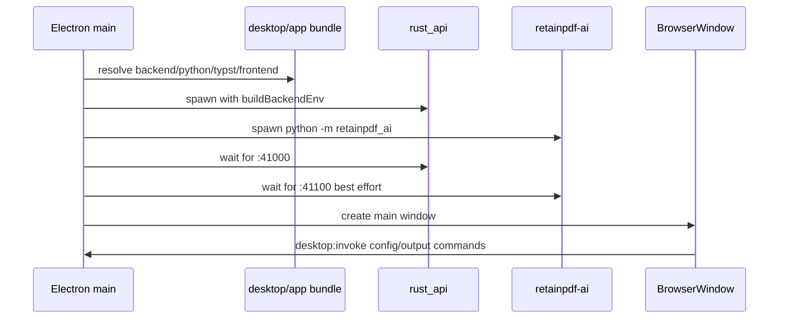

# Electron Desktop Runtime

Purpose: Trang nay mo ta Electron runtime, IPC surface va desktop packaging. No danh cho maintainer phat hanh desktop hoac debug startup.

## Responsibilities

Electron owns single-instance app lifecycle, splash/main window/tray, local backend startup, retainpdf-ai startup, desktop runtime env, bundled assets, IPC bridge and package preparation. It does not own API semantics, translation/render algorithms, or web build logic beyond copying/rewriting runtime assets.

## Key Files And Symbols

| Area | Source |
| --- | --- |
| Main process | [`desktop/main.js`](../../../desktop/main.js) |
| Preload/IPC bridge | [`desktop/preload.js`](../../../desktop/preload.js) |
| Env assembly | [`backend-env.js`](../../../desktop/src/main/backend-env.js) |
| Backend runtime resolution | [`backend-runtime.js`](../../../desktop/src/main/backend-runtime.js), [`python-runtime.js`](../../../desktop/src/main/python-runtime.js) |
| Reuse/external backend check | [`backend-http.js`](../../../desktop/src/main/backend-http.js) |
| Windows/tray/config/logs | [`desktop-windows.js`](../../../desktop/src/main/desktop-windows.js), [`desktop-config.js`](../../../desktop/src/main/desktop-config.js), [`desktop-logging.js`](../../../desktop/src/main/desktop-logging.js) |
| Package prep | [`prepare-app.mjs`](../../../desktop/scripts/prepare-app.mjs), [`package.json`](../../../desktop/package.json) |

## How It Works

[`desktop/main.js`](../../../desktop/main.js) requests a single-instance lock, opens splash, resolves bundled backend root/binary/Python/Typst, prepares data root under `app.getPath("userData")`, checks ports `41000` and `42000`, then spawns Rust API and retainpdf-ai. In packaged builds, a busy API port is treated as an error unless explicitly allowed; in development it may reuse an existing compatible backend after health/jobs checks in [`backend-http.js`](../../../desktop/src/main/backend-http.js).

[`buildBackendEnv()`](../../../desktop/src/main/backend-env.js) sets Rust and AI envs, including `RUST_API_KEYS=retain-pdf-desktop`, `RUST_API_DATA_ROOT`, `RUST_API_PROJECT_ROOT`, `RUST_API_SCRIPTS_DIR`, Python path/runtime settings, Typst/font settings, and retainpdf-ai `RETAIN_AI_*` settings.

[`preload.js`](../../../desktop/preload.js) exposes `window.retainPdfDesktop` with `invoke`, `loadDesktopConfig`, `saveDesktopConfig`, and `onStartupProgress`. Main IPC supports `load_desktop_config`, `save_desktop_config`, and `open_output_directory`.

## Execution Or Data Flow

## Configuration

Desktop hardcodes API/simple/AI ports in [`desktop/main.js`](../../../desktop/main.js). Packaged runtime config is written by [`prepare-app.mjs`](../../../desktop/scripts/prepare-app.mjs), which sets frontend `apiBase` to `http://127.0.0.1:41000`, `xApiKey` to `retain-pdf-desktop`, default OCR provider to `paddle`, and default model/base URL. The backend env uses the same desktop key for Rust and retainpdf-ai.

## Failure Modes

Startup can fail for missing `rust_api` binary, missing Python runtime, missing scripts, missing Typst in packaged builds, busy ports, or failed bundled Python import checks. `prepare-app.mjs` verifies bundled fonts and Python imports; `main.js` logs startup diagnostics and shows error boxes with log path.

## Extension Points

Add new IPC commands in `desktop/main.js` and expose safe wrappers in `preload.js`. Add new backend envs in `backend-env.js` and package assets in `prepare-app.mjs`. For new frontend runtime config fields, update desktop `runtime-config.js` generation and browser runtime parser.

## Source References

- [`desktop/main.js`](../../../desktop/main.js)
- [`desktop/preload.js`](../../../desktop/preload.js)
- [`desktop/src/main/backend-env.js`](../../../desktop/src/main/backend-env.js)
- [`desktop/scripts/prepare-app.mjs`](../../../desktop/scripts/prepare-app.mjs)

## Related Pages

- [Deployment](../06-operations/deployment.md)
- [Configuration](../02-getting-started/configuration.md)
- [Security](../06-operations/security.md)

