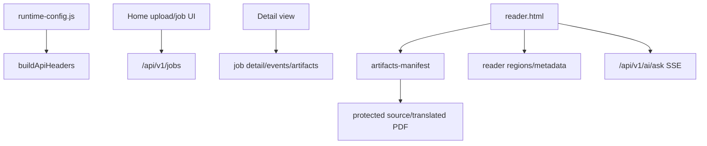

# Frontend Library And Reader

Purpose: Trang nay mo ta production frontend, library/status/detail surfaces va reader. No danh cho frontend developer can sua UX hoac API integration.

## Responsibilities

Frontend owns browser UI, runtime config consumption, API clients, upload/job/library workflows, detail/status views, reader rendering, notes/favorites UI and AI chat UI. It does not own job state, filesystem artifacts, or OCR/translation/render logic.

## Key Files And Symbols

| Area | Source |
| --- | --- |
| Build entries | [`build-js-bundle.mjs`](../../../frontend/scripts/build-js-bundle.mjs) |
| Home app | [`home/entry.tsx`](../../../frontend/src/pages/home/entry.tsx), [`build-home-services.ts`](../../../frontend/src/pages/home/composition/build-home-services.ts) |
| Detail app | [`DetailApp.tsx`](../../../frontend/src/pages/detail/DetailApp.tsx) |
| Reader entry | [`reader/entry.tsx`](../../../frontend/src/pages/reader/entry.tsx), [`ReaderApp.tsx`](../../../frontend/src/pages/reader/ReaderApp.tsx), [`ReaderAppReactPdf.tsx`](../../../frontend/src/pages/reader/ReaderAppReactPdf.tsx) |
| Reader controller | [`use-reader-react-controller.ts`](../../../frontend/src/pages/reader/hooks/use-reader-react-controller.ts), [`use-reader-session.ts`](../../../frontend/src/pages/reader/hooks/use-reader-session.ts) |
| API runtime | [`runtime.ts`](../../../frontend/src/js/config/runtime.ts), [`http.ts`](../../../frontend/src/js/api/http.ts) |
| API clients | [`jobs-submit.ts`](../../../frontend/src/js/api/jobs-submit.ts), [`documents.ts`](../../../frontend/src/js/api/documents.ts), [`ai.ts`](../../../frontend/src/js/api/ai.ts) |
| Reader ports | [`data-port.ts`](../../../frontend/src/js/reader/data-port.ts), [`pdf-document.ts`](../../../frontend/src/js/reader/pdf-document.ts) |

## How It Works

The production frontend is esbuild-based. [`build-js-bundle.mjs`](../../../frontend/scripts/build-js-bundle.mjs) builds three entries: home, detail and reader. Runtime config is read from `window.__FRONT_RUNTIME_CONFIG__` by [`runtime.ts`](../../../frontend/src/js/config/runtime.ts), and API clients attach `X-API-Key` using `buildApiHeaders()`.

[`jobs-submit.ts`](../../../frontend/src/js/api/jobs-submit.ts) enforces grouped job payloads before calling `/api/v1/jobs`, matching Rust `CreateJobInput`. Library clients call document/favorite/collection/search routes. Reader default engine is React/pdf.js; [`reader/entry.tsx`](../../../frontend/src/pages/reader/entry.tsx) keeps `?engine=legacy` fallback but defaults to React reader.

[`useReaderSession()`](../../../frontend/src/pages/reader/hooks/use-reader-session.ts) resolves job/document IDs, loads job payload + artifact manifest + regions + metadata through [`data-port.ts`](../../../frontend/src/js/reader/data-port.ts), resolves source/translated PDF URLs, downloads protected PDF bytes, then allows the React reader to mount.

## Execution Or Data Flow

## Configuration

Frontend defaults are runtime-config driven. `apiBase()` chooses configured `apiBase`, same-origin HTTPS, or `http://<host>:41000`. `frontendApiKey()` reads `xApiKey`. Model/OCR defaults are also read from runtime config. Docker writes values via [`entrypoint-web.sh`](../../../docker/entrypoint-web.sh), desktop writes a bundled `runtime-config.js` in [`prepare-app.mjs`](../../../desktop/scripts/prepare-app.mjs).

## Failure Modes

API failures are wrapped in user-facing errors in [`http.ts`](../../../frontend/src/js/api/http.ts). Reader fails if no source/translated resource is available or protected download fails; [`useReaderSession()`](../../../frontend/src/pages/reader/hooks/use-reader-session.ts) sets failed boot state. AI request errors distinguish service 502, auth 401 and missing LLM key 400 in [`ai.ts`](../../../frontend/src/js/api/ai.ts).

## Extension Points

Add API clients under `frontend/src/js/api`, then wire them through home/reader composition ports. For new reader behavior, prefer default React reader (`pages/reader/hooks`, `pdf`, `components/react-pdf`) and keep legacy engine only for fallback. For workflow payload fields, update frontend payload builder plus Rust request model and Python stage spec.

## Source References

- [`frontend/scripts/build-js-bundle.mjs`](../../../frontend/scripts/build-js-bundle.mjs)
- [`frontend/src/js/config/runtime.ts`](../../../frontend/src/js/config/runtime.ts)
- [`frontend/src/pages/reader/README.md`](../../../frontend/src/pages/reader/README.md)
- [`frontend/src/pages/reader/hooks/use-reader-session.ts`](../../../frontend/src/pages/reader/hooks/use-reader-session.ts)

## Related Pages

- [API reference](../05-interfaces/api-reference.md)
- [retainpdf-ai service](retainpdf-ai-service.md)
- [Common change scenarios](../07-development/common-change-scenarios.md)

