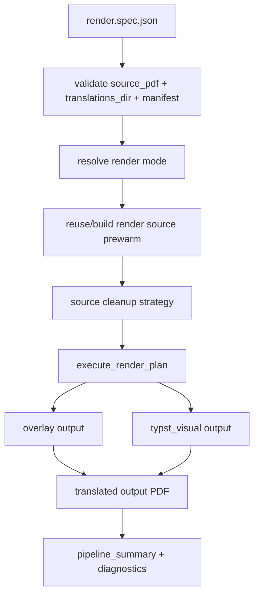

# PDF Rendering Pipeline

Purpose: Trang nay mo ta render pipeline tao PDF dich tu source PDF va translation manifest. No danh cho developer sua output PDF, cleanup, Typst, prewarm hoac render-only workflow.

## Responsibilities

Rendering owns render-mode resolution, source cleanup, render-source/prewarm artifacts, Typst/overlay output, compression/save behavior, side-by-side output helpers and render diagnostics. It does not own translation policy or API job state.

## Key Files And Symbols

| Area | Source |
| --- | --- |
| Entrypoint | [`run_render_only.py`](../../../backend/scripts/entrypoints/run_render_only.py), [`render_only.py`](../../../backend/scripts/services/rendering/workflow/render_only.py) |
| Runtime stage | [`run_render_stage()`](../../../backend/scripts/runtime/pipeline/render_stage.py) |
| Inputs | [`render_inputs.py`](../../../backend/scripts/runtime/pipeline/render_inputs.py) |
| Plan/mode | [`render_plan.py`](../../../backend/scripts/runtime/pipeline/render_plan.py), [`render_mode.py`](../../../backend/scripts/runtime/pipeline/render_mode.py) |
| Executor | [`executor.py`](../../../backend/scripts/services/rendering/workflow/executor.py) |
| Prewarm | [`prewarm.py`](../../../backend/scripts/services/rendering/source/prewarm.py) |
| Cleanup | [`source_cleanup/executor.py`](../../../backend/scripts/services/rendering/source_cleanup/executor.py) |
| Typst/output | [`book_renderer.py`](../../../backend/scripts/services/rendering/output/typst/book_renderer.py) |
| Side-by-side | [`side_by_side_pdf.py`](../../../backend/scripts/services/rendering/tools/side_by_side_pdf.py) |

## How It Works

Rust writes `render.spec.json` via [`write_render_stage_spec()`](../../../backend/rust_api/src/worker_command/stage_specs.rs). The spec includes `source_pdf`, `translations_dir`, `translation_manifest`, page range, render mode, compile workers, font family, compression DPI, layout tuning and cleanup strategy.

[`render_only.py`](../../../backend/scripts/services/rendering/workflow/render_only.py) loads the spec, applies layout tuning, enables job event/log capture, calls [`run_render_stage()`](../../../backend/scripts/runtime/pipeline/render_stage.py), and writes pipeline summary. The runtime plan validates inputs, resolves effective mode, loads translations, optionally uses prewarm cache, and calls [`execute_render_plan()`](../../../backend/scripts/services/rendering/workflow/executor.py).

Render modes include overlay and Typst visual paths. Auto mode can inspect source PDF/document analysis in [`render_mode.py`](../../../backend/scripts/runtime/pipeline/render_mode.py). Output generation is implemented in [`book_renderer.py`](../../../backend/scripts/services/rendering/output/typst/book_renderer.py), using PyMuPDF/pikepdf/Typst helpers.

## Execution Or Data Flow

## Configuration

Render parameters come from grouped API `render` payload and Rust defaults in [`render.rs`](../../../backend/rust_api/src/models/input/render.rs). External binaries/fonts come from Docker/Electron envs: `TYPST_BIN`, `TYPST_PACKAGE_PATH`, `TYPST_PACKAGE_CACHE_PATH`, `RETAIN_PDF_FONT_PATH`, `RETAIN_PDF_TYPST_FONT_DIRS`; see [`Dockerfile.app`](../../../docker/Dockerfile.app) and [`backend-env.js`](../../../desktop/src/main/backend-env.js).

## Failure Modes

Missing `translation-manifest.json` or source PDF causes render-only input errors in [`render_inputs.py`](../../../backend/scripts/runtime/pipeline/render_inputs.py). Typst compile failures trigger bad-page detection/sanitization retry in [`book_renderer.py`](../../../backend/scripts/services/rendering/output/typst/book_renderer.py). Missing Typst/font assets fails container/desktop render. Cleanup can skip pages and report metadata through cleanup result objects.

## Extension Points

Add a render option in Rust [`RenderInput`](../../../backend/rust_api/src/models/input/render.rs), include it in `render.spec.json`, consume it in Python render spec/plan, and expose it in frontend controls. Add a render mode in `render_mode.py` and `executor.py`, then add output implementation and tests.

## Source References

- [`backend/rust_api/src/worker_command/stage_specs.rs`](../../../backend/rust_api/src/worker_command/stage_specs.rs)
- [`backend/scripts/services/rendering/workflow/render_only.py`](../../../backend/scripts/services/rendering/workflow/render_only.py)
- [`backend/scripts/runtime/pipeline/render_stage.py`](../../../backend/scripts/runtime/pipeline/render_stage.py)
- [`backend/scripts/services/rendering/output/typst/book_renderer.py`](../../../backend/scripts/services/rendering/output/typst/book_renderer.py)

## Related Pages

- [Translation and LLM orchestration](translation-and-llm-orchestration.md)
- [Data flow](../03-architecture/data-flow.md)
- [Build and test](../06-operations/build-and-test.md)

