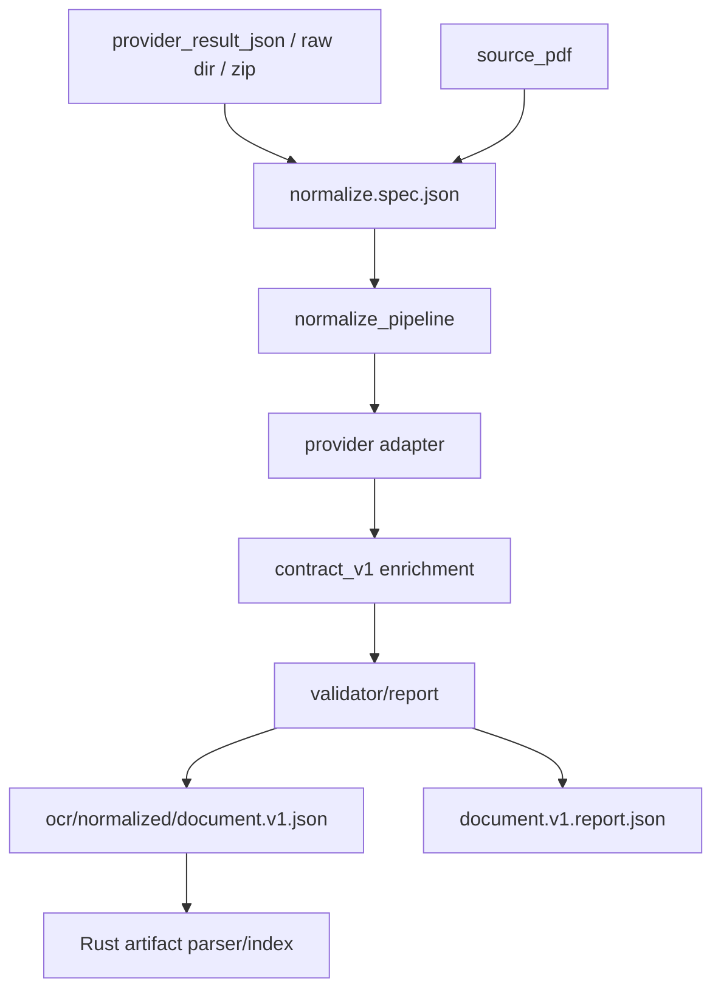

# Python OCR And Document Normalization

Purpose: Trang nay mo ta Python OCR/normalization pipeline: provider result -> `document.v1.json` + validation report. No danh cho developer them provider, sua schema, hoac debug OCR artifacts.

## Responsibilities

OCR co hai phan: Rust provider flow va Python normalization. Rust co the goi MinerU/Paddle transport, download provider result, hoac chay local provider command. Python normalization chuan hoa provider payload thanh `document.v1`, enrich block metadata, validate schema va ghi report. Python normalization khong quan ly queue, auth hay SQLite.

## Key Files And Symbols

| Area | Source |
| --- | --- |
| Entrypoint wrapper | [`run_normalize_ocr.py`](../../../backend/scripts/entrypoints/run_normalize_ocr.py) |
| Main pipeline | [`normalize_pipeline.py`](../../../backend/scripts/services/document_schema/normalize_pipeline.py) |
| Stage spec model | [`NormalizeStageSpec`](../../../backend/scripts/foundation/shared/stage_specs.py) |
| Provider adapters | [`adapters.py`](../../../backend/scripts/services/document_schema/adapters.py), [`provider_adapters`](../../../backend/scripts/services/document_schema/provider_adapters) |
| Contract enrichment | [`contract_v1.py`](../../../backend/scripts/services/document_schema/contract_v1.py) |
| Schema/version | [`document.v1.schema.json`](../../../backend/scripts/services/document_schema/document.v1.schema.json), [`version.py`](../../../backend/scripts/services/document_schema/version.py) |
| Validator | [`validator.py`](../../../backend/scripts/services/document_schema/validator.py) |
| Rust OCR flow | [`ocr_flow/mod.rs`](../../../backend/rust_api/src/job_runner/ocr_flow/mod.rs), [`paddle.rs`](../../../backend/rust_api/src/job_runner/ocr_flow/paddle.rs), [`mineru.rs`](../../../backend/rust_api/src/job_runner/ocr_flow/mineru.rs) |

## How It Works

Rust writes `normalize.spec.json` via [`write_normalize_stage_spec()`](../../../backend/rust_api/src/worker_command/stage_specs.rs). The spec includes provider, source JSON/PDF, provider version, result JSON, provider zip and raw directory. [`normalize_pipeline.py`](../../../backend/scripts/services/document_schema/normalize_pipeline.py) loads the spec, checks input files, adapts provider payload through `adapt_path_to_document_v1_with_report`, rescales geometry when needed, writes `ocr/normalized/document.v1.json`, writes `document.v1.report.json`, and prints stdout labels for Rust.

Adapters in [`adapters.py`](../../../backend/scripts/services/document_schema/adapters.py) detect or enforce provider types including `generic_flat_ocr`, `mineru`, `mineru_content_list_v2`, and `paddle`. [`contract_v1.py`](../../../backend/scripts/services/document_schema/contract_v1.py) enriches blocks with geometry/content roles/policy/provenance/continuation hints.

## Execution Or Data Flow

Source references: [`normalize_pipeline.py`](../../../backend/scripts/services/document_schema/normalize_pipeline.py), [`stage_specs.rs`](../../../backend/rust_api/src/worker_command/stage_specs.rs), [`contracts.py`](../../../backend/scripts/services/pipeline_shared/contracts.py).

## Configuration

Provider definitions and credential metadata live in [`ocr_providers.json`](../../../backend/config/ocr_providers.json). Rust provider runtime limits/timeouts live in [`provider.rs`](../../../backend/rust_api/src/config/provider.rs). Local OCR provider uses `RETAIN_LOCAL_OCR_COMMAND` and `RETAIN_OCR_RAW_PROVIDER` per provider config. Normalization itself is driven by the stage spec rather than ad-hoc env.

## Failure Modes

Missing provider result/source PDF fails early in [`normalize_pipeline.py`](../../../backend/scripts/services/document_schema/normalize_pipeline.py). Provider mismatch can error unless adapter detection accepts it. Schema validation errors are represented by [`DocumentSchemaValidationError`](../../../backend/scripts/services/document_schema/validator.py) and report output. Rust can fail later if `normalized_document_json` is not published or not a file.

## Extension Points

To add an OCR provider output format: add provider definition if needed, add adapter/detector under `document_schema/provider_adapters`, update `adapters.py`, add schema/report tests under Python devtools tests, and ensure Rust provider flow writes the provider result path used by normalization.

## Source References

- [`backend/scripts/services/document_schema/normalize_pipeline.py`](../../../backend/scripts/services/document_schema/normalize_pipeline.py)
- [`backend/scripts/services/document_schema/adapters.py`](../../../backend/scripts/services/document_schema/adapters.py)
- [`backend/scripts/services/document_schema/document.v1.schema.json`](../../../backend/scripts/services/document_schema/document.v1.schema.json)
- [`backend/rust_api/src/job_runner/ocr_flow/mod.rs`](../../../backend/rust_api/src/job_runner/ocr_flow/mod.rs)

## Related Pages

- [Data models](../05-interfaces/data-models.md)
- [Cross-runtime contracts](../05-interfaces/cross-runtime-contracts.md)
- [External integrations](../05-interfaces/external-integrations.md)
