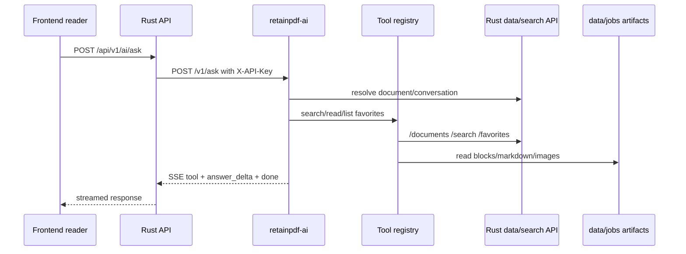

# retainpdf-ai Service

Purpose: Trang nay mo ta resident AI service dung cho hoi dap thu vien, retrieval tools, citations, streaming va conversation persistence. No danh cho developer sua AI reader/library behavior.

## Responsibilities

retainpdf-ai owns agentic Q&A loop, tool definitions, retrieval over Rust API and job artifacts, streaming answer events, citation normalization, and optional conversation history/compression. Rust remains data-plane owner: documents, favorites, FTS search, conversations and messages are accessed through Rust HTTP API.

## Key Files And Symbols

| Area | Source |
| --- | --- |
| Service docs | [`backend/ai_service/README.md`](../../../backend/ai_service/README.md) |
| FastAPI app | [`retainpdf_ai/app.py`](../../../backend/ai_service/retainpdf_ai/app.py) |
| Settings | [`config.py`](../../../backend/ai_service/retainpdf_ai/config.py) |
| Agent loop | [`RetrievalAgent`](../../../backend/ai_service/retainpdf_ai/agent.py) |
| Tools | [`ToolRegistry`](../../../backend/ai_service/retainpdf_ai/tools.py) |
| Rust client | [`rust_client.py`](../../../backend/ai_service/retainpdf_ai/rust_client.py) |
| Rust proxy | [`ai_proxy.rs`](../../../backend/rust_api/src/routes/ai_proxy.rs) |
| Frontend caller | [`frontend/src/js/api/ai.ts`](../../../frontend/src/js/api/ai.ts) |

## How It Works

Frontend posts `/api/v1/ai/ask` with `stream: true` via [`askLibraryAi()`](../../../frontend/src/js/api/ai.ts). Rust proxy forwards body and `X-API-Key` to retainpdf-ai `/v1/ask` and streams bytes back; source: [`ai_proxy.rs`](../../../backend/rust_api/src/routes/ai_proxy.rs).

[`app.py`](../../../backend/ai_service/retainpdf_ai/app.py) authenticates `X-API-Key`, optionally resolves a document by job, creates/loads conversation state through Rust, and calls the retrieval agent. The agent in [`agent.py`](../../../backend/ai_service/retainpdf_ai/agent.py) uses a custom function-calling loop, invokes tools from [`tools.py`](../../../backend/ai_service/retainpdf_ai/tools.py), and returns answers with citations/tool trace.

Tools include list/search/read/favorites operations. `read_blocks` reads job artifacts under data root with safe job-id/path checks in [`tools.py`](../../../backend/ai_service/retainpdf_ai/tools.py). Search/list/conversation operations go through [`rust_client.py`](../../../backend/ai_service/retainpdf_ai/rust_client.py).

## Execution Or Data Flow

## Configuration

retainpdf-ai settings include `RETAIN_AI_API_KEYS`, `RETAIN_AI_RUST_API_KEY`, `RETAIN_AI_RUST_API_BASE`, `RETAIN_AI_LLM_API_KEY`, `RETAIN_AI_LLM_BASE_URL`, `RETAIN_AI_LLM_MODEL`, `RETAIN_AI_PORT`, data root and memory/tool limits; see [`config.py`](../../../backend/ai_service/retainpdf_ai/config.py) and [`README.md`](../../../backend/ai_service/README.md). Electron sets these in [`backend-env.js`](../../../desktop/src/main/backend-env.js).

## Failure Modes

If retainpdf-ai is down, Rust returns bad gateway. If API key mismatches, FastAPI rejects request. Missing LLM key can be supplied per request or env depending on settings. Tool reads guard against unsafe job IDs/paths in [`tools.py`](../../../backend/ai_service/retainpdf_ai/tools.py). Frontend has explicit 502/401/400 hints in [`ai.ts`](../../../frontend/src/js/api/ai.ts).

## Extension Points

Add a tool by extending `ToolRegistry` schema and handler, then update agent prompt/loop if needed. Add new Rust data operations to `rust_client.py` only after adding stable Rust API routes. For UI behavior, update reader assistant components and `askLibraryAi()` payload handling.

## Source References

- [`backend/ai_service/retainpdf_ai/app.py`](../../../backend/ai_service/retainpdf_ai/app.py)
- [`backend/ai_service/retainpdf_ai/agent.py`](../../../backend/ai_service/retainpdf_ai/agent.py)
- [`backend/ai_service/retainpdf_ai/tools.py`](../../../backend/ai_service/retainpdf_ai/tools.py)
- [`backend/rust_api/src/routes/ai_proxy.rs`](../../../backend/rust_api/src/routes/ai_proxy.rs)

## Related Pages

- [API reference](../05-interfaces/api-reference.md)
- [Security](../06-operations/security.md)
- [Frontend library and reader](frontend-library-and-reader.md)

