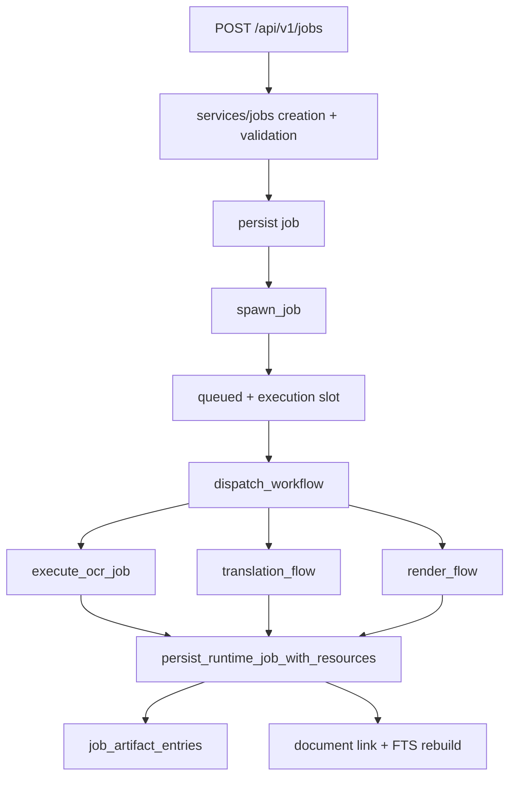

# Rust API And Job Runner

Purpose: Trang nay giai thich Rust API va job runner, component trung tam quan ly API, state, queue va handoff sang Python. No danh cho backend developer va maintainer.

## Responsibilities

Rust API owns HTTP routes, auth, config, SQLite, uploads, jobs, library data, artifact manifests, cancellation/resume/retry, provider polling for built-in remote OCR flows, and AI proxy. Job runner owns workflow orchestration and stage specs. It does not own OCR/translation/render algorithms; those live in Python services.

## Key Files And Symbols

| Area | Source |
| --- | --- |
| Process entry | [`main.rs`](../../../backend/rust_api/src/main.rs), [`run_servers()`](../../../backend/rust_api/src/app/server.rs) |
| Router | [`build_app()`](../../../backend/rust_api/src/app/router.rs), [`build_simple_app()`](../../../backend/rust_api/src/app/router.rs) |
| App state | [`AppState`](../../../backend/rust_api/src/app/state.rs) |
| Config | [`AppConfig`](../../../backend/rust_api/src/config.rs), [`config`](../../../backend/rust_api/src/config) |
| DB | [`Database`](../../../backend/rust_api/src/db.rs), [`db/schema.rs`](../../../backend/rust_api/src/db/schema.rs) |
| Job lifecycle | [`spawn_job()`](../../../backend/rust_api/src/job_runner/lifecycle.rs), [`dispatch_workflow()`](../../../backend/rust_api/src/job_runner/lifecycle.rs) |
| Workflow modules | [`ocr_flow`](../../../backend/rust_api/src/job_runner/ocr_flow), [`translation_flow.rs`](../../../backend/rust_api/src/job_runner/translation_flow.rs), [`render_flow.rs`](../../../backend/rust_api/src/job_runner/render_flow.rs) |
| Stage specs | [`stage_specs.rs`](../../../backend/rust_api/src/worker_command/stage_specs.rs) |

## How It Works

[`build_app()`](../../../backend/rust_api/src/app/router.rs) registers all full API endpoints under `/api/v1/*` and wraps them with API-key middleware. It also exposes `/health` outside that protected route group. [`build_simple_app()`](../../../backend/rust_api/src/app/router.rs) exposes `/api/v1/translate/bundle` on the simple port.

Job payloads are grouped through [`CreateJobInput`](../../../backend/rust_api/src/models/input/request.rs): `workflow`, `source`, `ocr`, `translation`, `render`, `runtime`. Tests in [`models/input.rs`](../../../backend/rust_api/src/models/input.rs) prove grouped payloads are accepted and legacy flat payloads are rejected.

[`spawn_job()`](../../../backend/rust_api/src/job_runner/lifecycle.rs) launches asynchronous execution. `run_job()` persists queued state, waits for a semaphore slot, dispatches workflow, persists terminal runtime state with artifact entries, then updates the document library and FTS index for successful non-OCR jobs. The job runner creates child OCR jobs for full `book`/`translate` flows through [`translation_flow.rs`](../../../backend/rust_api/src/job_runner/translation_flow.rs).

## Execution Or Data Flow

Source references: [`lifecycle.rs`](../../../backend/rust_api/src/job_runner/lifecycle.rs), [`job_writes.rs`](../../../backend/rust_api/src/db/job_writes.rs), [`storage_paths/registry.rs`](../../../backend/rust_api/src/storage_paths/registry.rs).

## Configuration

Rust config is assembled in [`AppConfig::from_env()`](../../../backend/rust_api/src/config.rs). Major envs:

| Key | Source/meaning |
| --- | --- |
| `RUST_API_KEYS`, `auth.local.json` | API auth and simple port/max jobs in [`auth.rs`](../../../backend/rust_api/src/config/auth.rs) |
| `RUST_API_PORT`, `RUST_API_BIND_HOST` | Full API bind in [`server.rs`](../../../backend/rust_api/src/config/server.rs) |
| `RUST_API_DATA_ROOT`, `RUST_API_SCRIPTS_DIR` | Runtime paths in [`paths.rs`](../../../backend/rust_api/src/config/paths.rs) |
| `RUST_API_MAX_RUNNING_JOBS` | Job semaphore in [`auth.rs`](../../../backend/rust_api/src/config/auth.rs) and [`AppState`](../../../backend/rust_api/src/app/state.rs) |
| `RUST_API_QUEUE_POLL_INTERVAL_MS`, worker terminate/diagnosis settings | [`job_runner.rs`](../../../backend/rust_api/src/config/job_runner.rs) |
| Provider limits/timeouts | [`provider.rs`](../../../backend/rust_api/src/config/provider.rs) |

## Failure Modes

Failures are persisted, not just returned to caller. [`persist_failed_job()`](../../../backend/rust_api/src/job_runner/lifecycle.rs) stores status, stage, error, timestamps and classified failure JSON. [`process_runner.rs`](../../../backend/rust_api/src/job_runner/process_runner.rs) handles process timeouts, cancellation, stdout/stderr capture and credential redaction. Missing artifacts are surfaced by [`stage_contract.rs`](../../../backend/rust_api/src/job_runner/stage_contract.rs) and contract views.

## Extension Points

- New route: add route in [`router.rs`](../../../backend/rust_api/src/app/router.rs), handler in `routes`, service in `services`, model/view types if needed, and API tests under `api_tests`.
- New workflow/stage: update models, validation, [`dispatch_workflow()`](../../../backend/rust_api/src/job_runner/lifecycle.rs), stage specs, worker command entrypoints, artifact registry, frontend payloads.
- New artifact: add storage path resolver/registry entry and expose through manifest/download routes.

## Source References

- [`backend/rust_api/src/app/router.rs`](../../../backend/rust_api/src/app/router.rs)
- [`backend/rust_api/src/job_runner/lifecycle.rs`](../../../backend/rust_api/src/job_runner/lifecycle.rs)
- [`backend/rust_api/src/worker_command/stage_specs.rs`](../../../backend/rust_api/src/worker_command/stage_specs.rs)
- [`backend/rust_api/src/db/schema.rs`](../../../backend/rust_api/src/db/schema.rs)

## Related Pages

- [Runtime lifecycle](../03-architecture/runtime-lifecycle.md)
- [API reference](../05-interfaces/api-reference.md)
- [Cross-runtime contracts](../05-interfaces/cross-runtime-contracts.md)

