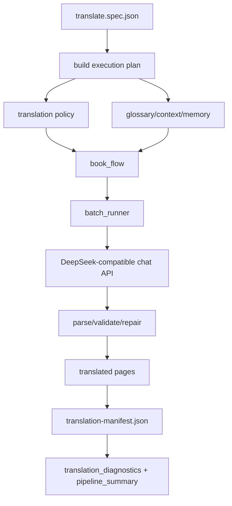

# Translation And LLM Orchestration

Purpose: Trang nay mo ta cach RetainPDF tao request dich, ap dung policy/glossary/context/memory, goi LLM va ghi diagnostics/manifest. No danh cho developer sua logic dich hoac tich hop model.

## Responsibilities

Translation component owns segmentation translation flow, policy decisions, glossary/context/memory modes, batching/concurrency, LLM provider calls, recovery/repair, diagnostics and `translation-manifest.json`. It does not own API job queue, OCR schema, or PDF render output.

## Key Files And Symbols

| Area | Source |
| --- | --- |
| Entrypoint | [`translate_only_pipeline.py`](../../../backend/scripts/services/translation/entrypoints/translate_only_pipeline.py) |
| Stage function | [`translate_book_pipeline()`](../../../backend/scripts/runtime/pipeline/translation_stage.py) |
| Execution request | [`TranslationExecutionRequest`](../../../backend/scripts/services/translation/workflow/execution.py) |
| Plan builder | [`execution_plan.py`](../../../backend/scripts/services/translation/workflow/execution_plan.py) |
| Runner | [`execution_runner.py`](../../../backend/scripts/services/translation/workflow/execution_runner.py) |
| Book flow | [`book_flow.py`](../../../backend/scripts/services/translation/workflow/book_flow.py) |
| Policy | [`config.py`](../../../backend/scripts/services/translation/services/policy/config.py), [`flow.py`](../../../backend/scripts/services/translation/services/policy/flow.py) |
| Batching | [`batch_runner.py`](../../../backend/scripts/services/translation/workflow/batch_runner.py) |
| Provider registry | [`provider_registry.py`](../../../backend/scripts/services/translation/llm/shared/provider_registry.py) |
| DeepSeek client | [`client.py`](../../../backend/scripts/services/translation/llm/providers/deepseek/client.py) |

## How It Works

Rust writes `translate.spec.json` with source JSON/PDF, optional layout JSON, page range, batch/workers, mode/math mode, title/classification options, glossary metadata/entries, context/glossary/memory modes, model/base URL, and credential ref `env:RETAIN_TRANSLATION_API_KEY`; source: [`write_translate_stage_spec()`](../../../backend/rust_api/src/worker_command/stage_specs.rs).

[`translate_only_pipeline.py`](../../../backend/scripts/services/translation/entrypoints/translate_only_pipeline.py) loads the spec, resolves credential ref, enables job log/event capture, invokes [`translate_book_pipeline()`](../../../backend/scripts/runtime/pipeline/translation_stage.py), writes diagnostics and summary, optionally blocks output if there are blocking untranslated items, and can run post-translation render prewarm.

[`execution_plan.py`](../../../backend/scripts/services/translation/workflow/execution_plan.py) loads OCR JSON, resolves page ranges, builds policy config, normalizes glossary entries and configures diagnostics/concurrency. [`book_flow.py`](../../../backend/scripts/services/translation/workflow/book_flow.py) handles continuation, policy, context windows, batch translation, repair and recovery.

## Execution Or Data Flow

Source references: [`translate_only_pipeline.py`](../../../backend/scripts/services/translation/entrypoints/translate_only_pipeline.py), [`batch_runner.py`](../../../backend/scripts/services/translation/workflow/batch_runner.py), [`provider_registry.py`](../../../backend/scripts/services/translation/llm/shared/provider_registry.py).

## Configuration

Translation config comes from stage spec parameters and credential refs. Defaults for `context_mode`, `glossary_mode`, and `memory_mode` are in Rust request model [`translation.rs`](../../../backend/rust_api/src/models/input/translation.rs). Active LLM provider runtime is DeepSeek-compatible in [`provider_registry.py`](../../../backend/scripts/services/translation/llm/shared/provider_registry.py), with default env/model/base URL in the DeepSeek client/provider config path.

## Failure Modes

Missing API key fails when default provider requires it. Protocol defects, malformed model output, rate limits, retries and structured JSON fallbacks are handled in [`translation_client.py`](../../../backend/scripts/services/translation/llm/providers/deepseek/translation_client.py) and DeepSeek client code. The entrypoint writes diagnostics and can report blocking untranslated items. Rust process runner captures stderr/stdout and persists failed job info.

## Extension Points

To add a new LLM provider, extend provider registry/client implementations and make sure request payload parsing, diagnostics and credential envs are handled. To add policy behavior, update policy config/flow and tests. To expose a new translation option to UI, add Rust request field, stage spec param, frontend payload builder, and Python spec consumer.

## Source References

- [`backend/rust_api/src/worker_command/stage_specs.rs`](../../../backend/rust_api/src/worker_command/stage_specs.rs)
- [`backend/scripts/services/translation/entrypoints/translate_only_pipeline.py`](../../../backend/scripts/services/translation/entrypoints/translate_only_pipeline.py)
- [`backend/scripts/services/translation/workflow/book_flow.py`](../../../backend/scripts/services/translation/workflow/book_flow.py)
- [`backend/scripts/services/translation/llm/shared/provider_registry.py`](../../../backend/scripts/services/translation/llm/shared/provider_registry.py)

## Related Pages

- [External integrations](../05-interfaces/external-integrations.md)
- [PDF rendering pipeline](pdf-rendering-pipeline.md)
- [Security](../06-operations/security.md)
