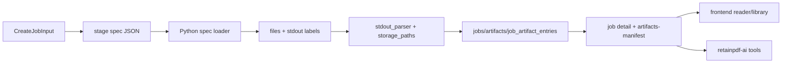

# Cross-Runtime Contracts

Purpose: Trang nay mo ta hop dong giua Rust, Python, retainpdf-ai va frontend. No la trang quan trong nhat khi thay doi payload, artifact, schema hoac stdout labels.

## Responsibilities

Contracts giu cho cac runtime doc lap giao tiep on dinh: Rust writes specs and parses outputs; Python consumes specs and writes artifacts; frontend calls documented API/resources; retainpdf-ai uses Rust API plus safe artifact reads. Moi thay doi contract phai duoc update hai dau.

## Key Files And Symbols

| Contract | Source |
| --- | --- |
| Stage specs | [`write_normalize_stage_spec()`](../../../backend/rust_api/src/worker_command/stage_specs.rs), [`write_translate_stage_spec()`](../../../backend/rust_api/src/worker_command/stage_specs.rs), [`write_render_stage_spec()`](../../../backend/rust_api/src/worker_command/stage_specs.rs), [`write_provider_stage_spec()`](../../../backend/rust_api/src/worker_command/stage_specs.rs) |
| Python spec loaders | [`backend/scripts/foundation/shared/stage_specs.py`](../../../backend/scripts/foundation/shared/stage_specs.py) |
| Stdout labels | [`contracts.py`](../../../backend/scripts/services/pipeline_shared/contracts.py), [`stdout_parser`](../../../backend/rust_api/src/job_runner/stdout_parser) |
| Artifact keys | [`storage_paths/constants.rs`](../../../backend/rust_api/src/storage_paths/constants.rs) |
| Stage readiness | [`stage_contract.rs`](../../../backend/rust_api/src/job_runner/stage_contract.rs), [`presentation/contracts.rs`](../../../backend/rust_api/src/services/jobs/presentation/contracts.rs) |
| Frontend API contract | [`runtime.ts`](../../../frontend/src/js/config/runtime.ts), [`http.ts`](../../../frontend/src/js/api/http.ts) |
| AI proxy contract | [`ai_proxy.rs`](../../../backend/rust_api/src/routes/ai_proxy.rs), [`retainpdf_ai/app.py`](../../../backend/ai_service/retainpdf_ai/app.py) |

## Stage Specs

| Spec | Schema version | Inputs | Important params | Consumer |
| --- | --- | --- | --- | --- |
| `normalize.spec.json` | `normalize.stage.v1` | provider, source JSON/PDF, provider result/zip/raw dir | none currently | [`normalize_pipeline.py`](../../../backend/scripts/services/document_schema/normalize_pipeline.py) |
| `translate.spec.json` | `translate.stage.v1` | source JSON/PDF, optional layout JSON | page range, batch/workers, mode/math, policy, glossary, context/memory, model/base URL, credential ref, render prewarm | [`translate_only_pipeline.py`](../../../backend/scripts/services/translation/entrypoints/translate_only_pipeline.py) |
| `render.spec.json` | `render.stage.v1` | source PDF, translations dir, translation manifest | render mode, compile workers, font/layout/compression/cleanup, model/base URL, credential ref | [`render_only.py`](../../../backend/scripts/services/rendering/workflow/render_only.py) |
| `provider.spec.json` | `provider.stage.v1` | source file URL/path | OCR options, translation/render params | [`run_provider_ocr.py`](../../../backend/scripts/entrypoints/run_provider_ocr.py) |

## Stdout And Artifact Contract

Python stdout labels are centralized in [`contracts.py`](../../../backend/scripts/services/pipeline_shared/contracts.py): `job root`, `source pdf`, `layout json`, `normalized document json`, `normalization report json`, `source json used`, `translations dir`, `output pdf`, `summary`, and `events jsonl`. Rust mirrors/uses these labels in [`stdout_parser/labels.rs`](../../../backend/rust_api/src/job_runner/stdout_parser/labels.rs) and artifact rules.

Artifact readiness contract:

| Contract | Required artifacts | Source |
| --- | --- | --- |
| `ocr_ready_for_translation` | `source_pdf`, `normalized_document_json`; optional `layout_json` | [`presentation/contracts.rs`](../../../backend/rust_api/src/services/jobs/presentation/contracts.rs) |
| `translation_ready_for_render` | `source_pdf`, `translations_dir`, `translation_manifest_json` | [`presentation/contracts.rs`](../../../backend/rust_api/src/services/jobs/presentation/contracts.rs) |
| `render_complete` | `output_pdf`, `summary` | [`presentation/contracts.rs`](../../../backend/rust_api/src/services/jobs/presentation/contracts.rs) |

## Execution Or Data Flow

## Configuration

Credential transfer avoids putting secrets into spec files when possible: translation API key becomes `credential_ref: env:RETAIN_TRANSLATION_API_KEY`; provider credentials use provider-specific env refs in [`stage_specs.rs`](../../../backend/rust_api/src/worker_command/stage_specs.rs). Frontend only sends API keys through request payload/runtime config; Rust injects worker env before launching processes.

## Failure Modes

Common contract failures: renamed stdout label, missing artifact key, schema version mismatch, frontend expecting a route not in `router.rs`, retainpdf-ai tool reading unsafe/missing job path, or Python stage not writing `pipeline_summary.json`. Link both ends when fixing: producer and consumer.

## Extension Points

For a new cross-runtime field:

1. Add Rust request/config field and validation.
2. Add stage spec param/input.
3. Add Python spec model and consumer logic.
4. Add stdout/artifact publication if output is new.
5. Add storage path/manifest/download route if frontend needs it.
6. Add frontend API/client/UI field.
7. Add tests at both producer and consumer.

## Source References

- [`backend/rust_api/src/worker_command/stage_specs.rs`](../../../backend/rust_api/src/worker_command/stage_specs.rs)
- [`backend/scripts/services/pipeline_shared/contracts.py`](../../../backend/scripts/services/pipeline_shared/contracts.py)
- [`backend/rust_api/src/services/jobs/presentation/contracts.rs`](../../../backend/rust_api/src/services/jobs/presentation/contracts.rs)
- [`frontend/src/js/api/http.ts`](../../../frontend/src/js/api/http.ts)

## Related Pages

- [Data flow](../03-architecture/data-flow.md)
- [Data models](data-models.md)
- [Common change scenarios](../07-development/common-change-scenarios.md)
