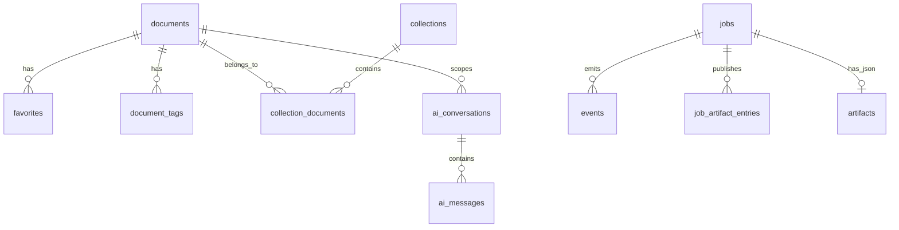

# Data Models

Purpose: Trang nay mo ta cac data model chinh: API job payload, SQLite entities, artifact model, `document.v1`, AI conversation data va frontend-facing job/library records.

## Responsibilities

Data models define compatibility contracts. Rust models own API input/output and DB rows. Python owns intermediate document schema and translation/render artifacts. Frontend consumes API views and should not infer filesystem layout.

## Key Files And Symbols

| Model | Source |
| --- | --- |
| Job input | [`CreateJobInput`](../../../backend/rust_api/src/models/input/request.rs), [`source.rs`](../../../backend/rust_api/src/models/input/source.rs), [`ocr.rs`](../../../backend/rust_api/src/models/input/ocr.rs), [`translation.rs`](../../../backend/rust_api/src/models/input/translation.rs), [`render.rs`](../../../backend/rust_api/src/models/input/render.rs), [`runtime.rs`](../../../backend/rust_api/src/models/input/runtime.rs) |
| Job/domain/view | [`models/job`](../../../backend/rust_api/src/models/job), [`models/view`](../../../backend/rust_api/src/models/view) |
| SQLite schema | [`db.rs`](../../../backend/rust_api/src/db.rs), [`db/schema.rs`](../../../backend/rust_api/src/db/schema.rs) |
| Artifact keys | [`storage_paths/constants.rs`](../../../backend/rust_api/src/storage_paths/constants.rs), [`registry.rs`](../../../backend/rust_api/src/storage_paths/registry.rs) |
| `document.v1` | [`document.v1.schema.json`](../../../backend/scripts/services/document_schema/document.v1.schema.json), [`version.py`](../../../backend/scripts/services/document_schema/version.py) |
| Translation manifest | [`execution_runner.py`](../../../backend/scripts/services/translation/workflow/execution_runner.py), [`storage_paths/constants.rs`](../../../backend/rust_api/src/storage_paths/constants.rs) |

## Job Request Model

Canonical job submission is grouped:

| Group | Important fields | Source |
| --- | --- | --- |
| `workflow` | `book`, `ocr`, `translate`, `render` | [`input.rs` tests](../../../backend/rust_api/src/models/input.rs) |
| `source` | `upload_id`, `source_url`, `artifact_job_id` | [`source.rs`](../../../backend/rust_api/src/models/input/source.rs) |
| `ocr` | provider, MinerU/Paddle tokens/options/page ranges/model fields | [`ocr.rs`](../../../backend/rust_api/src/models/input/ocr.rs) |
| `translation` | mode, math mode, glossary, context/glossary/memory modes, api key, model/base URL, pages, batch/workers | [`translation.rs`](../../../backend/rust_api/src/models/input/translation.rs) |
| `render` | render mode, compile workers, Typst font, compression, layout tuning, cleanup strategy | [`render.rs`](../../../backend/rust_api/src/models/input/render.rs) |
| `runtime` | `job_id`, `timeout_seconds` | [`runtime.rs`](../../../backend/rust_api/src/models/input/runtime.rs) |

## SQLite Entities

Core job tables are created/maintained in [`db.rs`](../../../backend/rust_api/src/db.rs): `uploads`, `jobs`, `artifacts`, `job_artifact_entries`, `events`, and `glossaries`. Library migrations in [`db/schema.rs`](../../../backend/rust_api/src/db/schema.rs) add:

| Entity/table | Role |
| --- | --- |
| `documents` | Library document metadata, active job, reading status |
| `favorites` | Anchored notes/quotes/assets per document/job/block |
| `collections`, `collection_documents` | Folder-like collection membership |
| `document_tags` | Many-to-many tags |
| `blocks_fts` | FTS5 trigram index over source/translated text |
| `assets` | Content-addressed uploaded assets |
| `ai_conversations`, `ai_messages` | AI chat history and branching |

## document.v1

`document.v1` root requires `schema`, `schema_version`, `document_id`, `source`, `page_count`, `pages`, `derived`, and `markers`. Current schema const is `normalized_document_v1`, version enum is `1.1`; source: [`document.v1.schema.json`](../../../backend/scripts/services/document_schema/document.v1.schema.json) and [`version.py`](../../../backend/scripts/services/document_schema/version.py).

Each page has `page_index`, `width`, `height`, `unit="pt"`, and `blocks`. Each block requires `block_id`, `page_index`, `order`, `geometry`, `content`, `layout_role`, `semantic_role`, `structure_role`, `policy`, `provenance`, `metadata`, `source`, and `continuation_hint`. Allowed content/layout/semantic values are schema-defined, not inferred.

## Artifact Model

Artifact keys include `source_pdf`, `translated_pdf`, `typst_source`, `typst_render_pdf`, `markdown_raw`, `markdown_images_dir`, `markdown_bundle_zip`, `normalized_document_json`, `normalization_report_json`, `layout_json`, `translation_manifest_json`, `translation_diagnostics_json`, `translation_debug_index_json`, `provider_bundle_zip`, `provider_result_json`, `provider_raw_dir`, `pipeline_summary`, `render_config_json`, `translations_dir`, and `events_jsonl`; source: [`constants.rs`](../../../backend/rust_api/src/storage_paths/constants.rs).

## Execution Or Data Flow

Source references: [`db/schema.rs`](../../../backend/rust_api/src/db/schema.rs), [`db/job_writes.rs`](../../../backend/rust_api/src/db/job_writes.rs), [`db/documents.rs`](../../../backend/rust_api/src/db/documents.rs).

## Configuration

DB path derives from data root in [`paths.rs`](../../../backend/rust_api/src/config/paths.rs). `document.v1` schema version is code-defined in [`version.py`](../../../backend/scripts/services/document_schema/version.py). Artifact paths are rooted under `data/jobs` via storage path helpers.

## Failure Modes

Legacy `jobs.artifacts_json` rows are rejected if non-empty by [`ensure_no_legacy_artifacts_json()`](../../../backend/rust_api/src/db/schema.rs). Missing required `document.v1` fields fail validation. Missing artifact files cause stage contract readiness failures. Library FTS rebuild is best-effort after successful jobs and logs errors without changing job status in [`update_document_after_job()`](../../../backend/rust_api/src/job_runner/lifecycle.rs).

## Extension Points

For API model changes, update Rust model structs, validation, frontend payload/client, and Python stage spec if cross-runtime. For DB changes, append versioned migration in `db/schema.rs`; do not edit historical migrations. For `document.v1`, update schema, enrichment/validator/adapters, and downstream consumers.

## Source References

- [`backend/rust_api/src/models/input/request.rs`](../../../backend/rust_api/src/models/input/request.rs)
- [`backend/rust_api/src/db/schema.rs`](../../../backend/rust_api/src/db/schema.rs)
- [`backend/scripts/services/document_schema/document.v1.schema.json`](../../../backend/scripts/services/document_schema/document.v1.schema.json)
- [`backend/rust_api/src/storage_paths/constants.rs`](../../../backend/rust_api/src/storage_paths/constants.rs)

## Related Pages

- [API reference](api-reference.md)
- [Cross-runtime contracts](cross-runtime-contracts.md)
- [Python OCR normalization](../04-components/python-ocr-normalization.md)

