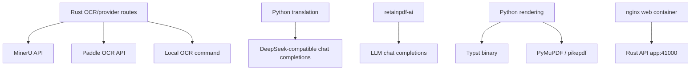

# External Integrations

Purpose: Trang nay mo ta cac provider, service va external tools ma RetainPDF goi hoac dong goi. No danh cho developer/DevOps cau hinh credentials, timeouts va provider behavior.

## Responsibilities

External integrations include OCR providers (MinerU, PaddleOCR, local command), LLM provider (DeepSeek-compatible chat API), PDF/rendering tools (Typst, PyMuPDF, pikepdf, optional Ghostscript), nginx/Docker runtime, and desktop-bundled Python/Typst/font assets.

## Key Files And Symbols

| Integration | Source |
| --- | --- |
| OCR provider definitions | [`ocr_providers.json`](../../../backend/config/ocr_providers.json), [`ocr_provider`](../../../backend/rust_api/src/ocr_provider) |
| MinerU runtime | [`mineru.rs`](../../../backend/rust_api/src/job_runner/ocr_flow/mineru.rs), [`ocr_provider/mineru`](../../../backend/rust_api/src/ocr_provider/mineru) |
| Paddle runtime | [`paddle.rs`](../../../backend/rust_api/src/job_runner/ocr_flow/paddle.rs), [`ocr_provider/paddle`](../../../backend/rust_api/src/ocr_provider/paddle) |
| Provider validation/probe | [`provider_probe.rs`](../../../backend/rust_api/src/services/provider_probe.rs), [`providers routes`](../../../backend/rust_api/src/routes/providers.rs) |
| DeepSeek translation | [`provider_registry.py`](../../../backend/scripts/services/translation/llm/shared/provider_registry.py), [`deepseek/client.py`](../../../backend/scripts/services/translation/llm/providers/deepseek/client.py) |
| retainpdf-ai LLM | [`agent.py`](../../../backend/ai_service/retainpdf_ai/agent.py), [`config.py`](../../../backend/ai_service/retainpdf_ai/config.py) |
| Typst/PDF tools | [`Dockerfile.app`](../../../docker/Dockerfile.app), [`book_renderer.py`](../../../backend/scripts/services/rendering/output/typst/book_renderer.py) |
| nginx | [`nginx.conf.template`](../../../docker/nginx.conf.template) |

## How It Works

OCR provider definitions declare display name, kind, credential field/env and options in [`ocr_providers.json`](../../../backend/config/ocr_providers.json). Rust supports built-in remote flows for MinerU and Paddle. MinerU can upload or create remote task and poll status; Paddle submits local/remote inputs, polls, downloads JSONL result and materializes markdown artifacts.

Translation uses a DeepSeek-compatible chat completions client. [`provider_registry.py`](../../../backend/scripts/services/translation/llm/shared/provider_registry.py) registers `provider_id="deepseek"`, default env `DEEPSEEK_API_KEY`, model `deepseek-v4-flash`, and base URL `https://api.deepseek.com/v1`. The client handles retry/rate limit/response format behavior.

Rendering shells out or calls tools/libraries available in Python runtime: Typst binary, PyMuPDF, pikepdf and font directories. Docker installs Typst and fonts; desktop packages runtime assets and verifies them.

## Execution Or Data Flow

## Configuration

| Integration | Key config |
| --- | --- |
| MinerU | `RETAIN_MINERU_API_TOKEN`, `RUST_API_MINERU_BASE_URL`, timeouts/retries in [`provider.rs`](../../../backend/rust_api/src/config/provider.rs) |
| Paddle | `RETAIN_PADDLE_API_TOKEN`, `RUST_API_PADDLE_BASE_URL`, `RUST_API_PADDLE_*` retry/input settings |
| DeepSeek translation | request `translation.api_key`, `translation.model`, `translation.base_url`, worker env `RETAIN_TRANSLATION_API_KEY` |
| retainpdf-ai | `RETAIN_AI_LLM_API_KEY`, `RETAIN_AI_LLM_BASE_URL`, `RETAIN_AI_LLM_MODEL` |
| Typst/fonts | `TYPST_BIN`, `TYPST_PACKAGE_PATH`, `TYPST_PACKAGE_CACHE_PATH`, `RETAIN_PDF_*FONT*` |
| Docker web | `FRONT_*` envs and nginx proxy settings |

## Failure Modes

Provider token validation can fail through `/api/v1/providers/*/validate-token`. OCR provider polling can timeout or return provider-specific task failures. DeepSeek calls can rate-limit, reject credentials, or return malformed structured output. Typst can fail compile and trigger sanitization retry. nginx can proxy wrong API if `FRONT_API_BASE`/compose service layout is changed incorrectly.

## Extension Points

Add OCR provider definition in `ocr_providers.json`, implement provider kind/transport or local command handling in Rust/Python, add validation route if needed, and update frontend provider config. Add LLM provider by extending Python provider registry/client and credential plumbing. Add render external tool by updating Docker/Electron packaging and Python render executor.

## Source References

- [`backend/config/ocr_providers.json`](../../../backend/config/ocr_providers.json)
- [`backend/rust_api/src/config/provider.rs`](../../../backend/rust_api/src/config/provider.rs)
- [`backend/scripts/services/translation/llm/providers/deepseek/client.py`](../../../backend/scripts/services/translation/llm/providers/deepseek/client.py)
- [`docker/Dockerfile.app`](../../../docker/Dockerfile.app)

## Related Pages

- [Configuration](../02-getting-started/configuration.md)
- [Security](../06-operations/security.md)
- [Translation and LLM orchestration](../04-components/translation-and-llm-orchestration.md)

