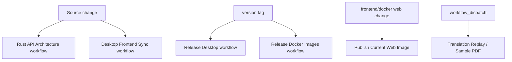

# Build And Test

Purpose: Trang nay tong hop build/test commands va CI workflows da xac minh tu manifests va `.github/workflows`. No danh cho developer va release maintainer.

## Responsibilities

Build/test chia theo component: Rust API cargo build/test, Python pipeline pytest/devtools checks, frontend esbuild/Tailwind/typecheck/smoke tests, Electron packaging/smoke checks, Docker image builds, CI workflows. Trang nay khong khang dinh tat ca commands da chay thanh cong trong phien tao Wiki; no mo ta commands duoc source khai bao.

## Key Files And Symbols

| Area | Source |
| --- | --- |
| Rust crate | [`backend/rust_api/Cargo.toml`](../../../backend/rust_api/Cargo.toml) |
| Python deps/tests | [`pyproject.toml`](../../../pyproject.toml), [`docker/requirements-test.txt`](../../../docker/requirements-test.txt) |
| Frontend scripts | [`frontend/package.json`](../../../frontend/package.json) |
| Desktop scripts | [`desktop/package.json`](../../../desktop/package.json) |
| Docker builds | [`Dockerfile.app`](../../../docker/Dockerfile.app), [`Dockerfile.web`](../../../docker/Dockerfile.web) |
| CI workflows | [`.github/workflows`](../../../.github/workflows) |

## Build Commands

| Component | Command | Source |
| --- | --- | --- |
| Rust API | `cargo build --manifest-path backend/rust_api/Cargo.toml` | [`rust-api-architecture.yml`](../../../.github/workflows/rust-api-architecture.yml), [`Cargo.toml`](../../../backend/rust_api/Cargo.toml) |
| Frontend | `npm --prefix frontend run build` | [`frontend/package.json`](../../../frontend/package.json) |
| Frontend JS only | `npm --prefix frontend run build:js` | [`frontend/package.json`](../../../frontend/package.json) |
| Frontend CSS only | `npm --prefix frontend run build:css` | [`frontend/package.json`](../../../frontend/package.json) |
| Desktop app prep | `npm --prefix desktop run prepare-app` | [`desktop/package.json`](../../../desktop/package.json), [`prepare-app.mjs`](../../../desktop/scripts/prepare-app.mjs) |
| Desktop Windows installer | `npm --prefix desktop run dist:win32-installer` | [`desktop/package.json`](../../../desktop/package.json) |
| Desktop macOS/Linux | `npm --prefix desktop run dist:mac` / `dist:linux` | [`desktop/package.json`](../../../desktop/package.json) |
| Docker app/web | Docker build actions use `docker/Dockerfile.app` and `docker/Dockerfile.web` | [`release-docker.yml`](../../../.github/workflows/release-docker.yml) |

## Test And Check Commands

| Check | Command/source |
| --- | --- |
| Rust architecture script | `python3 backend/rust_api/scripts/check_architecture.py` in [`rust-api-architecture.yml`](../../../.github/workflows/rust-api-architecture.yml) |
| Python pipeline architecture | `python3 backend/scripts/devtools/check_pipeline_architecture.py` in [`rust-api-architecture.yml`](../../../.github/workflows/rust-api-architecture.yml) |
| Rust targeted tests | `cargo test --manifest-path backend/rust_api/Cargo.toml --lib ...` in [`rust-api-architecture.yml`](../../../.github/workflows/rust-api-architecture.yml) |
| Python requirement sync | `python backend/scripts/devtools/sync_python_requirements.py --repo-root . --check` in translation/desktop workflows |
| Translation replay pytest | `python -m pytest -q ...` in [`translation-replay.yml`](../../../.github/workflows/translation-replay.yml) |
| Frontend typecheck | `npm --prefix frontend run typecheck` in [`frontend/package.json`](../../../frontend/package.json) |
| Frontend tests | `npm --prefix frontend test` in [`frontend/package.json`](../../../frontend/package.json) |
| Frontend smoke/visual | `smoke:*`, `visual:check` scripts in [`frontend/package.json`](../../../frontend/package.json) |
| Desktop bundle smoke | `npm --prefix desktop run smoke:frontend-bundle` in [`desktop/package.json`](../../../desktop/package.json) and release workflows |
| Desktop bundle validation | `.github/scripts/validate_desktop_bundle.py` in [`release-desktop.yml`](../../../.github/workflows/release-desktop.yml) |

## How It Works

Frontend build first prepares vendor runtime deps, generates version, builds CSS, builds JS, then stamps cache version. Docker web build runs `npm ci` and `npm run build`, then serves static files from nginx. Desktop `prepare-app` builds frontend, copies frontend/backend scripts/AI service/binaries/runtime assets, writes runtime config, and emits `bundle-manifest.json`.

Rust architecture workflow is source-controlled CI for Rust/Python pipeline boundaries. It runs architecture scripts, cargo build, and targeted tests around env injection and secret redaction.

## Execution Or Data Flow

## Configuration

CI uses Node 20/22 depending on workflow, Python 3.11, stable Rust toolchain, Docker buildx/QEMU for images, and Typst downloads for desktop/sample workflows. Source references: [`release-desktop.yml`](../../../.github/workflows/release-desktop.yml), [`release-docker.yml`](../../../.github/workflows/release-docker.yml), [`translate-sample-pdf.yml`](../../../.github/workflows/translate-sample-pdf.yml).

## Failure Modes

Frontend builds can fail when optional native Tailwind oxide dependency is missing; workflows explicitly probe/install it. Desktop packaging can fail if Python bundle imports or font assets are missing; `prepare-app.mjs` and release workflow validate these. Rust tests can fail if route redaction/env injection contracts drift.

## Extension Points

Add CI checks to the workflow owning the component. Add frontend tests under `frontend/tests` and package script. Add Rust tests under `backend/rust_api/src/*` or `api_tests`. Add Python tests under `backend/scripts/devtools/tests` matching current patterns.

## Source References

- [`frontend/package.json`](../../../frontend/package.json)
- [`desktop/package.json`](../../../desktop/package.json)
- [`backend/rust_api/Cargo.toml`](../../../backend/rust_api/Cargo.toml)
- [`.github/workflows/rust-api-architecture.yml`](../../../.github/workflows/rust-api-architecture.yml)
- [`.github/workflows/release-desktop.yml`](../../../.github/workflows/release-desktop.yml)

## Related Pages

- [Deployment](deployment.md)
- [Prerequisites](../02-getting-started/prerequisites.md)
- [Common change scenarios](../07-development/common-change-scenarios.md)

