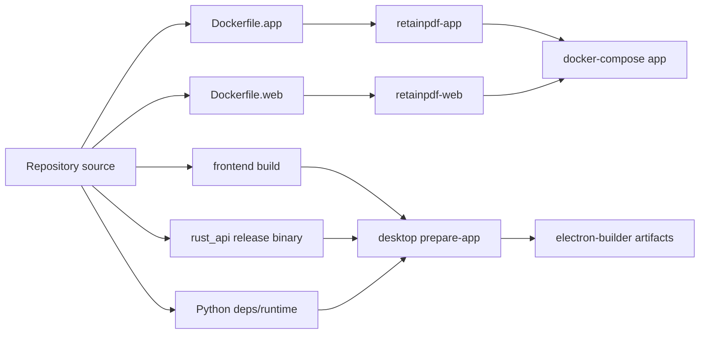

# Deployment

Purpose: Trang nay mo ta Docker delivery va desktop release/deployment flow. No danh cho DevOps va release maintainer.

## Responsibilities

Deployment co hai duong chinh: containerized web/app deployment va Electron desktop packaging. Docker path chay Rust/Python app container + nginx/static web container. Desktop path dong goi frontend, Rust binary, Python runtime/deps, scripts, retainpdf-ai, Typst, fonts vao app resources.

## Key Files And Symbols

| Area | Source |
| --- | --- |
| Compose | [`docker/delivery/docker-compose.yml`](../../../docker/delivery/docker-compose.yml) |
| App image | [`docker/Dockerfile.app`](../../../docker/Dockerfile.app), [`docker/entrypoint-app.sh`](../../../docker/entrypoint-app.sh) |
| Web image | [`docker/Dockerfile.web`](../../../docker/Dockerfile.web), [`docker/entrypoint-web.sh`](../../../docker/entrypoint-web.sh), [`nginx.conf.template`](../../../docker/nginx.conf.template) |
| Delivery env | [`docker/delivery/docker/app.env`](../../../docker/delivery/docker/app.env), [`web.env`](../../../docker/delivery/docker/web.env), [`auth.local.json`](../../../docker/delivery/docker/auth.local.json) |
| Desktop package | [`desktop/package.json`](../../../desktop/package.json), [`prepare-app.mjs`](../../../desktop/scripts/prepare-app.mjs) |
| Release CI | [`release-docker.yml`](../../../.github/workflows/release-docker.yml), [`publish-current-web.yml`](../../../.github/workflows/publish-current-web.yml), [`release-desktop.yml`](../../../.github/workflows/release-desktop.yml) |

## Docker Deployment

`docker-compose.yml` defines:

| Service | Role | Ports/health |
| --- | --- | --- |
| `app` | Rust API + Python pipeline runtime | `${APP_PORT:-41000}:41000`, `${APP_SIMPLE_PORT:-42000}:42000`, health `/health` |
| `web` | nginx static frontend + `/api` proxy | `${WEB_PORT:-40001}:80`, health proxied to app `/health` |

The app image builds Rust API, installs Python requirements, Typst, fonts and Typst packages, sets runtime envs and exposes `41000/42000`. The web image builds `frontend`, copies output to nginx, writes runtime config at container startup, and proxies `/api/` to `app:41000`.

## Desktop Deployment

`prepare-app.mjs` copies frontend into `desktop/app/frontend`, copies backend scripts and retainpdf-ai, copies Rust API binary if present, bundles Python/Typst/fonts when available/required, prepares pdf.js/pdf-lib vendor assets, writes frontend runtime config, verifies bundled Python imports, and emits `backend/bundle-manifest.json`. `electron-builder` uses `desktop/package.json` build config for Windows portable/NSIS, macOS DMG, and Linux deb.

## Build/Deployment Flow

## Configuration

Docker delivery keys live in `docker/delivery/docker/*.env` and `auth.local.json`. `web.env` must set `FRONT_X_API_KEY` to one backend API key. App container data is persisted through `app_data:/data`. Desktop uses per-user data root and local-only ports/key generated in Electron env.

## Failure Modes

Docker web can fail if nginx cannot proxy `app:41000`, if `runtime-config.js` contains wrong key/base URL, or if app health fails. Desktop release can fail if tag/version missing, Rust binary missing, Typst/Python runtime packaging fails, Python import checks fail, or frontend bundle smoke fails; these checks are visible in [`release-desktop.yml`](../../../.github/workflows/release-desktop.yml).

## Extension Points

Add container runtime env to `app.env`/`web.env`, Dockerfile and config parser. Add desktop asset/runtime to `prepare-app.mjs` and verify in bundle manifest. Add release automation to matching GitHub workflow.

## Source References

- [`docker/delivery/docker-compose.yml`](../../../docker/delivery/docker-compose.yml)
- [`docker/Dockerfile.app`](../../../docker/Dockerfile.app)
- [`docker/Dockerfile.web`](../../../docker/Dockerfile.web)
- [`desktop/scripts/prepare-app.mjs`](../../../desktop/scripts/prepare-app.mjs)
- [`.github/workflows/release-docker.yml`](../../../.github/workflows/release-docker.yml)

## Related Pages

- [Configuration](../02-getting-started/configuration.md)
- [Electron desktop runtime](../04-components/electron-desktop-runtime.md)
- [Security](security.md)

