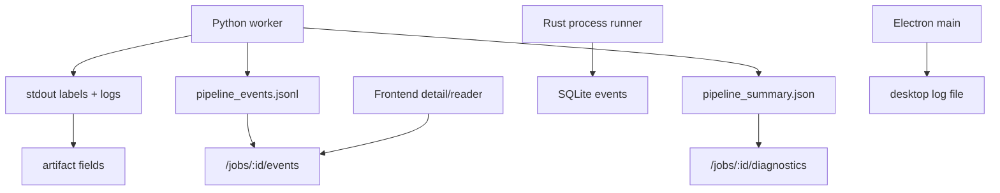

# Observability

Purpose: Trang nay mo ta logs, events, diagnostics va artifacts dung de quan sat RetainPDF. No danh cho operator va developer debug job/runtime.

## Responsibilities

Observability den tu Rust tracing/HTTP trace, SQLite job events, Python `pipeline_events.jsonl`, pipeline summaries/diagnostics, provider diagnostics, translation debug artifacts, frontend error messages, desktop logs, and retainpdf-ai tool trace/citations.

## Key Files And Symbols

| Signal | Source |
| --- | --- |
| Rust tracing | [`main.rs`](../../../backend/rust_api/src/main.rs), [`router.rs`](../../../backend/rust_api/src/app/router.rs) |
| DB events | [`db/events.rs`](../../../backend/rust_api/src/db/events.rs), [`job_events`](../../../backend/rust_api/src/job_events) |
| Pipeline events | [`contracts.py`](../../../backend/scripts/services/pipeline_shared/contracts.py), [`live_stage/pipeline_events.rs`](../../../backend/rust_api/src/services/jobs/live_stage/pipeline_events.rs) |
| Pipeline summaries | [`translate_only_pipeline.py`](../../../backend/scripts/services/translation/entrypoints/translate_only_pipeline.py), [`render_only.py`](../../../backend/scripts/services/rendering/workflow/render_only.py) |
| Job diagnostics route | [`routes/jobs`](../../../backend/rust_api/src/routes/jobs), [`facade/query/diagnostics.rs`](../../../backend/rust_api/src/services/jobs/facade/query/diagnostics.rs) |
| Desktop logs | [`desktop-logging.js`](../../../desktop/src/main/desktop-logging.js), [`desktop/main.js`](../../../desktop/main.js) |
| AI trace | [`ai.ts`](../../../frontend/src/js/api/ai.ts), [`agent.py`](../../../backend/ai_service/retainpdf_ai/agent.py) |

## How It Works

Rust uses `tracing_subscriber` in [`main.rs`](../../../backend/rust_api/src/main.rs) and `TraceLayer` in [`router.rs`](../../../backend/rust_api/src/app/router.rs). Job events are persisted in SQLite and can be retrieved through job events API. Python stages write `pipeline_events.jsonl` and `pipeline_summary.json`; Rust can load pipeline events into live-stage records.

Translation writes `translation_diagnostics.json`, debug index and review artifacts. Render writes render diagnostics into pipeline summary. Job detail views can load invocation/glossary summaries from translation manifest or pipeline summary through view support code.

## Execution Or Data Flow

## Configuration

Rust tracing can be controlled with standard tracing env filter behavior configured in [`main.rs`](../../../backend/rust_api/src/main.rs). Event retention cleanup is implemented in [`app/cleanup.rs`](../../../backend/rust_api/src/app/cleanup.rs) and [`db/retention.rs`](../../../backend/rust_api/src/db/retention.rs). Desktop log path is resolved by [`desktop-logging.js`](../../../desktop/src/main/desktop-logging.js).

## Failure Modes

If job detail lacks artifacts but files exist, stdout/artifact publication may have failed. If API events are sparse, check `pipeline_events.jsonl` and Rust live-stage loaders. If desktop UI never opens, inspect startup diagnostics and log path from `desktop/main.js`. If AI answer looks ungrounded, inspect frontend `toolTrace` and retainpdf-ai citations/tool trace.

## Extension Points

Add new structured event types in Python pipeline event emitters and Rust live-stage loaders. Add new diagnostics artifact in artifact registry and diagnostics route. Add desktop startup signal in `desktop/main.js` and logger module. Add frontend presentation in detail/reader components.

## Source References

- [`backend/rust_api/src/db/events.rs`](../../../backend/rust_api/src/db/events.rs)
- [`backend/scripts/services/pipeline_shared/contracts.py`](../../../backend/scripts/services/pipeline_shared/contracts.py)
- [`backend/rust_api/src/services/jobs/live_stage/pipeline_events.rs`](../../../backend/rust_api/src/services/jobs/live_stage/pipeline_events.rs)
- [`desktop/src/main/desktop-logging.js`](../../../desktop/src/main/desktop-logging.js)

## Related Pages

- [Troubleshooting](../02-getting-started/troubleshooting.md)
- [Runtime lifecycle](../03-architecture/runtime-lifecycle.md)
- [API reference](../05-interfaces/api-reference.md)

