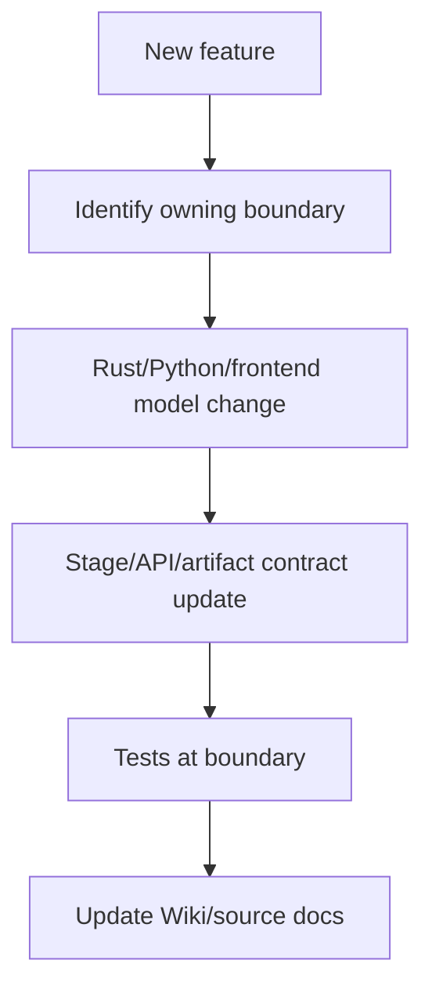

# Extension Guide

Purpose: Trang nay la huong dan mo rong he thong theo ownership hien co. No danh cho developer can them behavior moi ma khong pha contract Rust/Python/frontend.

## Responsibilities

Extensions nen ton trong boundaries: Rust owns API/job/state/contracts; Python owns document transformations; frontend owns UX/API clients; Electron/Docker owns packaging/runtime. Moi thay doi cross-runtime can update producer va consumer.

## Key Files And Symbols

| Extension type | Starting points |
| --- | --- |
| API route | [`router.rs`](../../../backend/rust_api/src/app/router.rs), [`routes`](../../../backend/rust_api/src/routes), [`services`](../../../backend/rust_api/src/services) |
| Job payload | [`models/input`](../../../backend/rust_api/src/models/input), [`jobs-submit.ts`](../../../frontend/src/js/api/jobs-submit.ts) |
| Stage spec | [`stage_specs.rs`](../../../backend/rust_api/src/worker_command/stage_specs.rs), [`backend/scripts/foundation/shared/stage_specs.py`](../../../backend/scripts/foundation/shared/stage_specs.py) |
| Artifact | [`storage_paths/constants.rs`](../../../backend/rust_api/src/storage_paths/constants.rs), [`storage_paths/registry.rs`](../../../backend/rust_api/src/storage_paths/registry.rs) |
| Python processing | [`backend/scripts/services`](../../../backend/scripts/services), [`backend/scripts/entrypoints`](../../../backend/scripts/entrypoints) |
| Translation worklist | [`scan_chinese_residue.py`](../../../backend/scripts/devtools/scan_chinese_residue.py), [`chinese-residue-report.md`](../translation/chinese-residue-report.md) |
| Frontend feature | [`frontend/src/pages/home/composition`](../../../frontend/src/pages/home/composition), [`frontend/src/js/api`](../../../frontend/src/js/api), [`frontend/src/pages/reader`](../../../frontend/src/pages/reader) |
| Desktop runtime | [`desktop/main.js`](../../../desktop/main.js), [`desktop/preload.js`](../../../desktop/preload.js), [`prepare-app.mjs`](../../../desktop/scripts/prepare-app.mjs) |
| Agent rules | [`AGENTS.md`](../../../AGENTS.md), [`.kilo/kilo.jsonc`](../../../.kilo/kilo.jsonc), [`docs/wiki/README.md`](../README.md) |
| Reusable agent skills | [`project-translator`](../../../skills/project-translator/SKILL.md), [`kilo-plan-writer`](../../../skills/kilo-plan-writer/SKILL.md), [`project-wiki-writer`](../../../skills/project-wiki-writer/SKILL.md) |

## How It Works

Most feature work crosses layers. Example: adding a translation option requires Rust model field, frontend payload field, stage spec param, Python spec model/consumer, tests, and perhaps docs/config. The existing `render` fields show the pattern: Rust [`RenderInput`](../../../backend/rust_api/src/models/input/render.rs) -> [`write_render_stage_spec()`](../../../backend/rust_api/src/worker_command/stage_specs.rs) -> Python render spec/plan -> frontend controls.

Agent-driven work starts from [`AGENTS.md`](../../../AGENTS.md). Codex and Kilo must read the relevant Wiki pages before implementation work, then update the Wiki whenever code, behavior, API, data, contract, config, deployment, or bug-fix behavior changes.

Use [`project-wiki-writer`](../../../skills/project-wiki-writer/SKILL.md) to bootstrap, update, or audit technical Wiki pages from repository evidence. It preserves the project's current documentation language and structure, and treats executable source plus checked-in contracts as the current implementation when prose is stale.

Chinese residue cleanup uses [`scan_chinese_residue.py`](../../../backend/scripts/devtools/scan_chinese_residue.py) to generate [`chinese-residue-report.md`](../translation/chinese-residue-report.md). Translate prompt entries to English, UI/comment/docs entries to Vietnamese, and preserve identifiers, JSON keys, API paths, env vars and placeholders.

## Execution Or Data Flow

## Configuration

New config should be read where it is owned. Rust runtime env in `backend/rust_api/src/config`. Frontend browser config in `runtime.ts` plus Docker/Electron writers. Python stage config in spec models, not random env, unless it is a secret or external runtime path.

## Failure Modes

Common extension bugs: adding a frontend field without Rust model; adding Rust model without Python spec consumer; writing an artifact without registering resolver/manifest; adding desktop runtime dependency without packaging it; adding provider secret to browser runtime accidentally.

## Extension Points

Use these patterns:

- API: route -> handler -> service -> DB/model -> API tests -> frontend client.
- Processing stage: Rust stage spec -> Python loader -> worker output -> stdout/artifact registry -> readiness contract.
- UI: API client -> composition port/hook -> component -> smoke/test.
- Deployment: env parser -> Docker/Electron injection -> CI/release validation.

## Source References

- [`backend/rust_api/src/app/router.rs`](../../../backend/rust_api/src/app/router.rs)
- [`backend/rust_api/src/worker_command/stage_specs.rs`](../../../backend/rust_api/src/worker_command/stage_specs.rs)
- [`frontend/src/pages/home/composition/README.md`](../../../frontend/src/pages/home/composition/README.md)
- [`frontend/src/pages/reader/README.md`](../../../frontend/src/pages/reader/README.md)

## Related Pages

- [Common change scenarios](common-change-scenarios.md)
- [Cross-runtime contracts](../05-interfaces/cross-runtime-contracts.md)
- [Technical debt and limitations](technical-debt-and-limitations.md)
