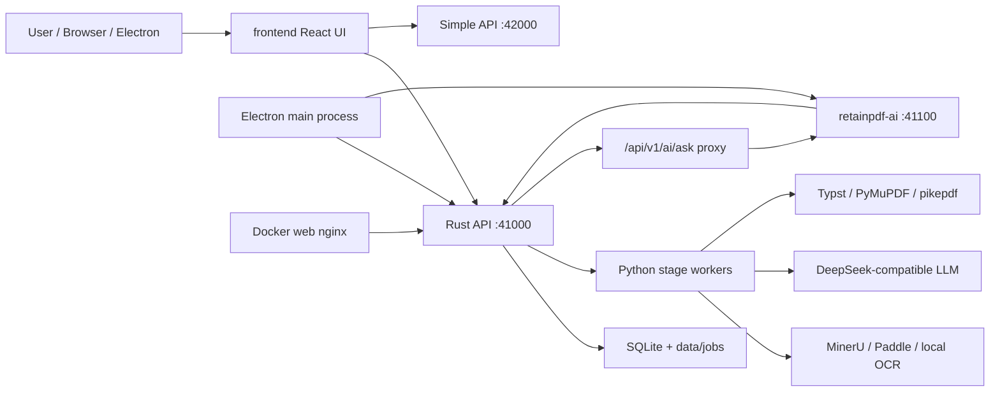

# RetainPDF Technical Wiki

Mục đích: Trang này là trung tâm điều hướng cho developer mới, backend/frontend developer, DevOps và maintainer. Wiki mô tả RetainPDF như một hệ thống dịch PDF giữ bố cục: Rust API quản lý state và hợp đồng, Python pipeline xử lý OCR/dịch/render, frontend/Electron/Docker cung cấp các runtime người dùng.

## Quy tắc Dự án

- Trước khi code, sửa bug, đổi config, chạy implementation work, hoặc ra quyết định kiến trúc, phải đọc các trang liên quan trong Wiki này.
- Sau khi thêm code, sửa bug, đổi behavior, API, data model, contract, config hoặc deployment, phải cập nhật trang Wiki liên quan trong cùng change.
- Nếu thay đổi không cần update Wiki, ghi rõ lý do trong final note hoặc PR description.
- Codex, Kilo và các coding agent khác phải tuân theo [`AGENTS.md`](../../AGENTS.md). Kilo cũng được nhắc lại quy tắc này trong [`.kilo/kilo.jsonc`](../../.kilo/kilo.jsonc).

## Bối cảnh Hệ thống

Giải thích: [`build_app()`](../../backend/rust_api/src/app/router.rs) phục vụ API chính, [`build_simple_app()`](../../backend/rust_api/src/app/router.rs) phục vụ simple bundle API, [`desktop/main.js`](../../desktop/main.js) khởi chạy Rust và retainpdf-ai trên desktop, và [`docker/nginx.conf.template`](../../docker/nginx.conf.template) proxy `/api` từ web container sang app container.

## Mục lục

| Phần | Trang |
| --- | --- |
| Tổng quan | [Project overview](01-overview/project-overview.md), [Repository structure](01-overview/repository-structure.md), [Technology stack](01-overview/technology-stack.md) |
| Bắt đầu | [Prerequisites](02-getting-started/prerequisites.md), [Local development](02-getting-started/local-development.md), [Configuration](02-getting-started/configuration.md), [Troubleshooting](02-getting-started/troubleshooting.md) |
| Kiến trúc | [System architecture](03-architecture/system-architecture.md), [Component boundaries](03-architecture/component-boundaries.md), [Data flow](03-architecture/data-flow.md), [Runtime lifecycle](03-architecture/runtime-lifecycle.md) |
| Thành phần | [Rust API and job runner](04-components/rust-api-and-job-runner.md), [Python OCR normalization](04-components/python-ocr-normalization.md), [Translation and LLM orchestration](04-components/translation-and-llm-orchestration.md), [PDF rendering](04-components/pdf-rendering-pipeline.md), [retainpdf-ai](04-components/retainpdf-ai-service.md), [Frontend library and reader](04-components/frontend-library-and-reader.md), [Electron desktop](04-components/electron-desktop-runtime.md) |
| Giao diện | [API reference](05-interfaces/api-reference.md), [Data models](05-interfaces/data-models.md), [Cross-runtime contracts](05-interfaces/cross-runtime-contracts.md), [External integrations](05-interfaces/external-integrations.md) |
| Vận hành | [Build and test](06-operations/build-and-test.md), [Deployment](06-operations/deployment.md), [Observability](06-operations/observability.md), [Security](06-operations/security.md) |
| Phát triển | [Extension guide](07-development/extension-guide.md), [Translation worklists](translation/README.md), [Common change scenarios](07-development/common-change-scenarios.md), [Technical debt and limitations](07-development/technical-debt-and-limitations.md) |

## Lộ trình Đọc

| Đối tượng | Lộ trình |
| --- | --- |
| Developer mới | [Project overview](01-overview/project-overview.md) -> [System architecture](03-architecture/system-architecture.md) -> [Data flow](03-architecture/data-flow.md) -> [Local development](02-getting-started/local-development.md) |
| Backend developer | [Rust API and job runner](04-components/rust-api-and-job-runner.md) -> [Cross-runtime contracts](05-interfaces/cross-runtime-contracts.md) -> [API reference](05-interfaces/api-reference.md) |
| Frontend developer | [Frontend library and reader](04-components/frontend-library-and-reader.md) -> [API reference](05-interfaces/api-reference.md) -> [Common change scenarios](07-development/common-change-scenarios.md) |
| DevOps | [Deployment](06-operations/deployment.md) -> [Configuration](02-getting-started/configuration.md) -> [Security](06-operations/security.md) -> [Observability](06-operations/observability.md) |
| Maintainer | [WIKI_PLAN](WIKI_PLAN.md) -> [WIKI_COVERAGE](WIKI_COVERAGE.md) -> [Technical debt and limitations](07-development/technical-debt-and-limitations.md) |

## Danh mục Thành phần

| Thành phần | Trách nhiệm | Công nghệ | Điểm vào | Trang Wiki |
| --- | --- | --- | --- | --- |
| Rust API | HTTP routes, auth, job state, artifact index, library data | Rust, Axum, Tokio, SQLite | [`main.rs`](../../backend/rust_api/src/main.rs) | [Rust API and job runner](04-components/rust-api-and-job-runner.md) |
| Python document pipeline | OCR normalization, translation, render workers | Python 3.11, PyMuPDF, pikepdf, Typst | [`backend/scripts/entrypoints`](../../backend/scripts/entrypoints) | [Python OCR normalization](04-components/python-ocr-normalization.md) |
| Translation orchestrator | Policy, glossary, context/memory, LLM retries and diagnostics | Python, DeepSeek-compatible chat API | [`translate_only_pipeline.py`](../../backend/scripts/services/translation/entrypoints/translate_only_pipeline.py) | [Translation and LLM orchestration](04-components/translation-and-llm-orchestration.md) |
| Rendering | Overlay/Typst PDF generation, cleanup, prewarm | Python, Typst, PyMuPDF, pikepdf | [`render_only.py`](../../backend/scripts/services/rendering/workflow/render_only.py) | [PDF rendering](04-components/pdf-rendering-pipeline.md) |
| retainpdf-ai | Library Q&A, tool calling, citations, conversations | FastAPI, Python | [`retainpdf_ai/app.py`](../../backend/ai_service/retainpdf_ai/app.py) | [retainpdf-ai service](04-components/retainpdf-ai-service.md) |
| Frontend | Uploads, library, status/detail, reader, AI chat | React, esbuild, pdf.js | [`home/entry.tsx`](../../frontend/src/pages/home/entry.tsx), [`reader/entry.tsx`](../../frontend/src/pages/reader/entry.tsx) | [Frontend library and reader](04-components/frontend-library-and-reader.md) |
| Electron | Desktop launcher, bundled backend, IPC bridge, package prep | Electron, Node.js | [`desktop/main.js`](../../desktop/main.js) | [Electron desktop runtime](04-components/electron-desktop-runtime.md) |
| Docker delivery | Containerized app and web runtime | Docker, nginx | [`docker-compose.yml`](../../docker/delivery/docker-compose.yml) | [Deployment](06-operations/deployment.md) |

## Các Luồng Quan trọng Nhất

1. Dịch toàn bộ: upload PDF -> tạo grouped `/api/v1/jobs` payload -> Rust tạo job -> OCR child job -> normalization -> translation -> render -> artifact manifest và cập nhật library FTS. Xem [Data flow](03-architecture/data-flow.md).
2. Tái sử dụng artifact: workflow `translate` hoặc `render` có thể đọc `source.artifact_job_id` thay vì upload lại khi các artifact cần thiết đã sẵn sàng. Xem [Cross-runtime contracts](05-interfaces/cross-runtime-contracts.md).
3. Reader: frontend mở `reader.html?job_id=...`, tải job detail, manifest, regions và metadata, tải xuống source/translated PDFs với `X-API-Key`, sau đó mount React/pdf.js. Xem [Frontend library and reader](04-components/frontend-library-and-reader.md).
4. AI Q&A: frontend gửi POST `/api/v1/ai/ask`; Rust proxy tới retainpdf-ai; retainpdf-ai gọi Rust data/search APIs và đọc job artifacts để trích dẫn có căn cứ. Xem [retainpdf-ai service](04-components/retainpdf-ai-service.md).
5. Desktop: Electron khởi động Rust API và retainpdf-ai, inject desktop runtime config, expose IPC cho config/output directory, sau đó mở frontend đã được bundle. Xem [Electron desktop runtime](04-components/electron-desktop-runtime.md).

## Tham khảo Nguồn

Các điểm neo triển khai chính: [`router.rs`](../../backend/rust_api/src/app/router.rs), [`lifecycle.rs`](../../backend/rust_api/src/job_runner/lifecycle.rs), [`stage_specs.rs`](../../backend/rust_api/src/worker_command/stage_specs.rs), [`contracts.py`](../../backend/scripts/services/pipeline_shared/contracts.py), [`document.v1.schema.json`](../../backend/scripts/services/document_schema/document.v1.schema.json), [`frontend runtime`](../../frontend/src/js/config/runtime.ts), [`desktop/main.js`](../../desktop/main.js), [`docker-compose.yml`](../../docker/delivery/docker-compose.yml).
